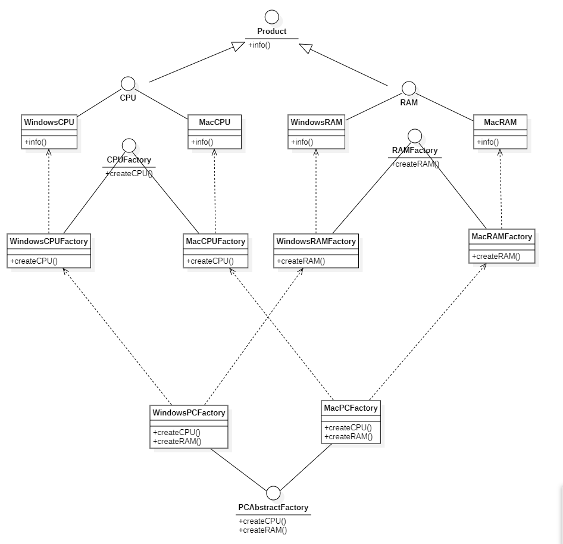
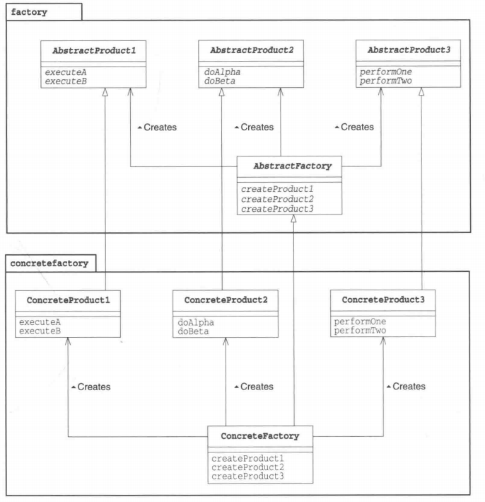

# 抽象工厂模式

## 概述

&emsp;抽象工厂模式定义了用于创建不同产品的接口，但将实际的创建工作留给了具体工厂类。每个工厂类型都对应一个特定的产品变体。与工厂方法模式不同的是抽象工厂针对的是生产一组相关的产品，即一个产品族。

## 类型

&emsp;抽象工厂模式属于创建型模式。

## 介绍

- **目的**：提供一个创建一系列相关或互相依赖对象的接口，而无需指定它们具体的类。
- **主要解决**：主要解决接口选择问题。
- **使用场景**：系统的产品有多于一个的产品族，而系统只消费其中某一族的产品。
- **解决方案**：在一个产品族里定义多个产品，在一个工厂里，聚合多个同类产品。
- **注意事项**：产品族难扩展，产品等级易扩展。

## 示例代码

&emsp;这里我们以电脑厂生产不同平台（Windows或Mac）使用的电脑为例。简单起见，生产电脑只用到两种产品，CPU和RAM。

### 分析

&emsp;抽象工厂定义了用于创建不同产品的接口，在本示例中，抽象工厂`PCAbstractFactory`,该接口定义了创建不同平台产品的接口，同时抽象产品为：`CPU`和`RAM`，因为不同平台的CPU和RAM是不一样的，因此具体的产品需要通过子类实现。

&emsp;对于Windows的CPU和RAM，通过实现抽象产品得到：`WindowsCPU`和`WindowsRAM`;Mac同理有：`MacCPU`和`MacRAM`;这些产品同样对应着工厂：`WindowsCPUFactory`、`WindowsRAMFactory`、`MacCPUFactory`、`MacRAMFactory`，这些工厂是专门生产CPU、RAM的。

&emsp;而生产不同平台电脑的产品又分别有对应的工厂，这些工厂需要实现最大的超级工厂`PCAbstractFactory`，分别为：`WindowsPCFactory`和`MacPCFactory`。这些工厂是专门生产不同平台电脑硬件产品的，比如WindowsPCFactory，它会提供WindowsCPU和WindowsRAM产品创建的接口。

### PCAbstractFactory接口

```java
package abstractFactory.factory;

import abstractFactory.product.CPU;
import abstractFactory.product.RAM;

public interface PCAbstractFactory {
    // 创建电脑CPU的接口
    CPU createCPU();
    // 创建电脑RAM的接口
    RAM createRAM();
}
```

### Product接口

&emsp;因为我这个示例中CPU和RAM都有一个共同的方法info，该方法会输出平台信息，所以引入了Product，统一info的定义

```java
package abstractFactory.product;

public interface Product {
    // 用于输出平台信息 和 RAM还是CPU
    void info();
}
```

### CPU接口

```java
package abstractFactory.product;

public interface CPU extends Product{

}
```

### CPUFactory接口

```java
package abstractFactory.factory;

import abstractFactory.product.CPU;

public interface CPUFactory {
    // 创建CPU的接口
    CPU createCPU();
}
```

### RAM接口

```java
package abstractFactory.product;

public interface RAM extends Product{
}
```

### RAMFactory接口

```java
package abstractFactory.factory;

import abstractFactory.product.RAM;

public interface RAMFactory {
    // 创建RAM的接口
    RAM createRAM();
}
```

&emsp;上述定义的均是抽象部分，下面则是具体实现部分的子类。

### WindowsCPU

```java
package abstractFactory;

import abstractFactory.product.CPU;

public class WindowsCPU implements CPU {
    @Override
    public void info() {
        System.out.println("This is CPU for Windows platform ");
    }
}
```

### WindowsCPUFactory

```java
package abstractFactory;

import abstractFactory.product.CPU;
import abstractFactory.factory.CPUFactory;

public class WindowsCPUFactory implements CPUFactory {
    @Override
    public CPU createCPU() {
        CPU windowsCPU = new WindowsCPU();
        windowsCPU.info();
        return windowsCPU;
    }
}
```

### WindowsRAM

```java
package abstractFactory;

import abstractFactory.product.RAM;

public class WindowsRAM implements RAM {
    @Override
    public void info() {
        System.out.println("This is ARM for Windows platform ");
    }
}
```

### WindowsRAMFactory

```java
package abstractFactory;

import abstractFactory.product.RAM;
import abstractFactory.factory.RAMFactory;

public class WindowsRAMFactory implements RAMFactory {
    @Override
    public RAM createRAM() {
        RAM windowsRAM = new WindowsRAM();
        windowsRAM.info();
        return windowsRAM;
    }
}
```

### WindowsPCFactory

```java
package abstractFactory;

import abstractFactory.factory.PCAbstractFactory;
import abstractFactory.product.CPU;
import abstractFactory.product.RAM;

public class WindowsPCFactory implements PCAbstractFactory {
    @Override
    public CPU createCPU() {
        return new WindowsCPUFactory().createCPU();
    }

    @Override
    public RAM createRAM() {
        return new WindowsRAMFactory().createRAM();
    }
}
```

### MacCPU

```java
package abstractFactory;

import abstractFactory.product.CPU;

public class MacCPU implements CPU {
    @Override
    public void info() {
        System.out.println("This is CPU for Mac platform ");
    }
}
```

### MacCPUFactory

```java
package abstractFactory;

import abstractFactory.product.CPU;
import abstractFactory.factory.CPUFactory;

public class MacCPUFactory implements CPUFactory {
    @Override
    public CPU createCPU() {
        CPU macCPU = new MacCPU();
        macCPU.info();
        return macCPU;
    }
}
```

### MacRAM

```java
package abstractFactory;

import abstractFactory.product.RAM;

public class MacRAM implements RAM {
    @Override
    public void info() {
        System.out.println("This is RAM for Mac platform ");
    }
}
```

### MacRAMFactory

```java
package abstractFactory;

import abstractFactory.product.RAM;
import abstractFactory.factory.RAMFactory;

public class MacRAMFactory implements RAMFactory {
    @Override
    public RAM createRAM() {
        RAM macRAM = new MacRAM();
        macRAM.info();
        return macRAM;
    }
}
```

### MacPCFactory

```java
package abstractFactory;

import abstractFactory.factory.PCAbstractFactory;
import abstractFactory.product.CPU;
import abstractFactory.product.RAM;

public class MacPCFactory implements PCAbstractFactory {
    @Override
    public CPU createCPU() {
        return new MacCPUFactory().createCPU();
    }

    @Override
    public RAM createRAM() {
        return new MacRAMFactory().createRAM();
    }
}
```

> 上面展示的类和接口可能比较多，但只要认真剖析每个类的实现及其作用，对整个抽象工厂模式就不难理解了，并且为了简单起见，已经极大减少了各个产品和工厂的属性、方法，因此阅读起来也会更加容易些。

&emsp;测试代码及结果如下：

```java
package abstractFactory;

import abstractFactory.factory.PCAbstractFactory;
import abstractFactory.product.CPU;
import abstractFactory.product.RAM;
import org.junit.Test;

public class AbstractFactoryTest {
    @Test
    public void abstractFactoryTest(){
        PCAbstractFactory windowsPCFactory = new WindowsPCFactory();
        CPU cpu = windowsPCFactory.createCPU();
        RAM ram = windowsPCFactory.createRAM();

        PCAbstractFactory macPCFactory = new MacPCFactory();
        CPU cpu1 = macPCFactory.createCPU();
        RAM ram1 = macPCFactory.createRAM();
    }
}
```

```text
This is CPU for Windows platform 
This is ARM for Windows platform 
This is CPU for Mac platform 
This is RAM for Mac platform
```

### 类图



## 抽象工厂中的角色

- **AbstractProduct**:抽象产品，用于定义AbstractFactory角色所生产的抽象零件和产品的接口。在上述示例中，`CPU`和`RAM`扮演着这一角色。
- **ConcreteProduct**:具体产品。在上述示例中，`WindowsCPU`、`WindowsRAM`、`MacCPU`和`MacRAM`扮演着这一角色。
- **AbstractFactory**:用于定义生成抽象产品的接口。在上述示例中，`PCAbstractFactory`扮演着这一角色。
- **ConcreteFactory**:具体生产产品的工厂。在上述示例中,`WindowsPCFactory`、`MacPCFactory`、`WindowsCPUFactory`等均扮演着这一角色。



## 其它

&emsp;抽象工厂模式通常涉及一族相关的产品(在本示例中，就有两族产品：Windows和Mac平台对应的PC)，每个具体工厂类负责创建该族中的具体产品。客户端通过使用抽象工厂接口来创建产品对象，而不需要直接使用具体产品的实现类。

&emsp;在抽象工厂模式中，每一个具体工厂都提供了多个工厂方法用于产生多种不同类型的产品。

&emsp;抽象工厂模式是工厂方法模式的升级版本，他用来创建一组相关或者相互依赖的对象。
