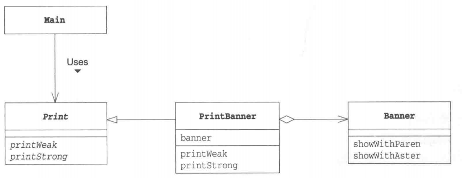

# 适配器模式

## 概述

&emsp;适配器(Adapter)模式用于将一个现有类的接口转换为我们实际需求的接口。

## 类型

&emsp;适配器模式属于结构型模式。

## 介绍

- **目的**：将一个类的接口转换成客户希望的另外一个接口。适配器模式使得原本由于接口不兼容而不能一起工作的那些类可以一起工作。
- **主要解决**：主要解决在软件系统中，常常要将一些"现存的对象"放到新的环境中，而新环境要求的接口是现对象不能满足的。
- **使用场景**：需要修改现有正常类的接口时，就可以考虑使用适配器模式。
- **解决方案**：通过继承或依赖正常类的接口。

&emsp;Adapter模式分为两种：**通过继承实现的类适配器模式**和**通过依赖实现的对象适配器模式**

## 示例代码

&emsp;现有一个正常类`Banner`,该类具有一个属性:`str`;两个方法：`showWithParen`和`showWithAster`,其功能分别是用括号和星号将str包裹起来进行输出。现在我们想让Banner类去实现一个Print接口，在该接口中分别声明了两个方法：`printWeak`和`printStrong`,这样我们就可以通过Print对象调用Banner里原有的方法。


> 上述类图中属性str为标出。这里主要是为了理清方法之间的关系


### 实现方式

&emsp;下面我们分别通过类适配模式和对象适配模式实现。这里先分别给出Banner类和Print接口的定义：

##### Banner类

```java
package adapter;

public class Banner {
    private String str;
    public Banner(String str){
        this.str = str;
    }
    public void showWithParen(){
        System.out.println("(" + str + ")" + ".This is a method that has been implemented before");
    }

    public void showWithAster(){
        System.out.println("*" + str + "*" + ".This is a method that has been implemented before") ;
    }
}
```

> 为了便于理解适配器模式究竟是干嘛的，我在每个方法后面加了一句话用于表示这些方法是我们正常类中已实现的方法。

##### Print接口

```java
package adapter;

public interface Print {
    public abstract void printWeak();
    public abstract void printStrong();
}
```

#### 类适配器模式

&emsp;类适配器模式的实现特点为：**继承被适配对象，实现现有的需求接口**。在我们实现接口时，我们只需调用通过继承得到的被适配对象的原方法，代码如下：


##### PrintBannerAdapterByExtend类

```java
package adapter;

public class PrintBannerAdapterByExtend extends Banner implements Print{

    public PrintBannerAdapterByExtend(String str){
        super(str);
    }

    @Override
    public void printWeak() {
        // 在实现Print接口中声明的printWeak时，我们就可以直接调用通过继承Banner类得到的showWithParen()方法从而实现接口适配
        showWithParen();
    }

    @Override
    public void printStrong() {
        // 在实现Print接口中声明的printStrong时，我们就可以直接调用通过继承Banner类得到的showWithAster()方法从而实现接口适配
        showWithAster();
    }
}
```
&emsp;接着我们编写一个单元测试跑一跑吧！

```java
package adapter;

import org.junit.Test;

public class AdapterTest {
    @Test
    public void adapterByExtendTest(){
        Print banner = new PrintBannerAdapterByExtend("Hello");
        banner.printStrong();
        banner.printWeak();
    }
}
```

&emsp;输出内容：

```
*Hello*.This is a method that has been implemented before
(Hello).This is a method that has been implemented before
```

&emsp;可以看到，我们通过Print接口对象就可以正常调用我们需要适配的类中的方法，这便是适配模式的作用和应用场景。我们需要让Print接口中声明的方法与原来Banner类中的方法功能一致，那么我们可以通过继承Banner类实现Print接口从而达到适配目的。


#### 对象适配器模式

&emsp;对象适配器模式其实可以简单理解为通过适配器调用原来已实现类的相关方法，这意味着通过这种方式实现的适配器内部有一个被适配类的对象。在通过这种方法实现的适配器之前，需要将Print定义为抽象类，而不是接口。

##### PrintAbstract类

```java
package adapter;

public abstract class PrintAbstract {
    public abstract void printWeak();
    public abstract void printStrong();
}
```

##### PrintBannerAdapterByRely类

```java
package adapter;

public class PrintBannerAdapterByRely extends PrintAbstract{
    private Banner banner;
    public PrintBannerAdapterByRely(String str){
        this.banner = new Banner(str);
    }
    @Override
    public void printWeak() {
        this.banner.showWithParen();
    }

    @Override
    public void printStrong() {
        this.banner.showWithAster();
    }
}
```

&emsp;测试代码如下：

```java
package adapter;

import org.junit.Test;

public class AdapterTest {
    
    @Test
    public void adapterByRelyTest(){
        PrintAbstract banner = new PrintBannerAdapterByRely("Hello");
        banner.printStrong();
        banner.printWeak();
    }
}
```

&emsp;运行结果：

```text
*Hello*.This is a method that has been implemented before
(Hello).This is a method that has been implemented before
```



### 适配器模式中的角色

&emsp;在适配器模式中，共有四种非常重要的角色：

- **Target**:也即对象，Target负责定义我们现在需要的方法。在上述示例代码中,`Print`和`PrintAbstract`就扮演着这一角色。
- **Client**:也即请求方，Client负责使用Target，在上述代码中，我们编写的单元测试就扮演这一角色。
- **Adaptee**：被适配对象，Adaptee是一个持有既定方法的角色，在上述示例中，`Banner`就扮演这一角色。
- **Adapter**：适配器，本模式的主角，Adapter使用Adaptee来实现Target需求，这是本模式的目的也是Adapter的作用，在上述示例中，`PrintBannerAdapterByExtend`和`PrintBannerAdapterByRely`就扮演这一角色。

&emsp;类适配器模式和对象适配器模式的类图分别如下：


&emsp;适配器并不是在项目设计阶段时考虑和添加的，而是解决现有项目的扩展问题。

### 其它

- 过多地使用适配器，会让系统非常零乱，不易整体进行把握。比如，明明看到调用的是 A 接口，其实内部被适配成了 B 接口的实现，一个系统如果太多出现这种情况，无异于一场灾难。因此如果不是很有必要，可以不使用适配器，而是直接对系统进行重构。 
- 由于 JAVA 至多继承一个类，所以至多只能适配一个适配者类，而且目标类必须是抽象类