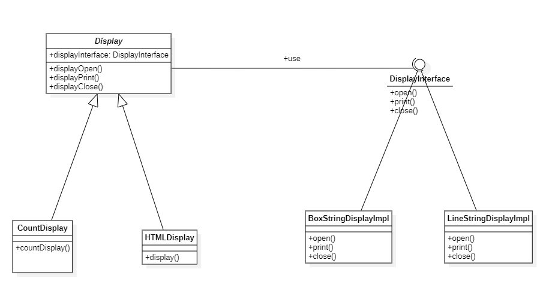
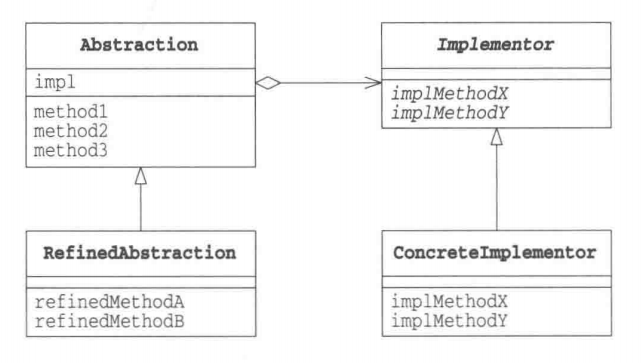

# 桥接模式

## 概述
&esmp;桥接(Bridge)模式是用于把抽象化与实现化解耦，使得二者可以独立变化。它通过提供抽象化和实现化之间的桥接结构，来实现二者的解耦。桥接模式桥接的两样东西分别是：**类的功能层次结构**和**类的实现层次结构**。

> 什么是类的功能层次结构和实现层次结构？
> 
> 一般来说，**父类具有基本功能，需要在子类中增加新的功能**这种子类继承父类扩展功能的结构称为类的功能层次结构。
>
> 而**父类通过声明抽象方法来定义接口，子类通过实现具体方法来实现接口**则称为类的实现层次结构。

## 类型

&emsp;桥接模式属于结构型模式。

## 介绍

- **目的**：将抽象部分与实现部分分离，使它们都可以独立的变化。
- **主要解决**：在有多种可能会变化的情况下，用继承会造成类爆炸问题，扩展起来不灵活。
- **使用场景**：实现系统可能有多个角度分类，每一种角度都可能变化。
- **解决方案**：把这种多角度分类分离出来，让它们独立变化，减少它们之间的耦合。

## 示例代码

&emsp;这里我们写一段示例程序，该程序的作用是打印一段字符串，相关类和接口的信息如下

- **Display**: 负责打印字符串的抽象类，定义了打印字符串的基本流程。
- **CountDisplay**：是`DisPlay`类的功能扩展，它允许按照一定的数字进行多次打印。
- **DisplayInterface**：它定义了打印的流程所涉及到的接口。
- **BoxStringDisplayImpl**：它实现了`DisplayInterface`所定义的接口，其最终的功能就是打印某一字符串。

&emsp;在上述类中，`BoxStringDisplayImpl`实现`DisplayInterface`从而构成了类的实现层次结构；`CountDisplay`继承`Display`来扩展新功能构成了类的功能层次结构。而桥接模式就是将这两部分进行桥接，从而实现抽象部分与实现部分的分离。

### DisplayInterface接口

&emsp;属于实现层次的最高层。

```java
package bridge;

public interface DisplayInterface {
    void open();
    void print();
    void close();
}
```

### BoxStringDisplayImpl类

```java
package bridge;

public class BoxStringDisplayImpl implements DisplayInterface{

    private String string;
    private int length;

    public StringDisplayImpl(String string){
        this.string = string;
        this.length = string.length();
    }

    @Override
    public void open() {
        printLine();
    }

    @Override
    public void print() {
        System.out.println("|" + this.string + "|");
    }

    @Override
    public void close() {
        printLine();
    }

    private void printLine(){
        // 打印：+----------------+
        System.out.println("+");
        for (int i=0;i<this.length;i++){
            System.out.print("-");
        }
        System.out.println("+");
    }
}
```

### Display抽象类

&emsp;属于功能层次的最高层。

```java
package bridge;

public abstract class Display {
    // 将实现层次的最高层引进来 从而实现功能层次与实现层次的桥接
    private DisplayInterface displayInterface;
    public Display(DisplayInterface displayInterface){
        this.displayInterface = displayInterface;
    }
    public void displayOpen(){
        displayInterface.open();
    }
    public void displayPrint(){
        displayInterface.print();
    }
    public void displayClose(){
        displayInterface.close();
    }
    public final void display(){
        displayOpen();
        displayPrint();
        displayClose();
    }
}
```

### CountDisplay类

&emsp;对Display的继承，拓展出一些新功能，在这里新加的功能就是：按一定次数进行输出。

```java
package bridge;

public class CountDisplay extends Display{
    public CountDisplay(DisplayInterface displayInterface) {
        super(displayInterface);
    }

    public void countDisplay(int cnt){
        displayOpen();
        for (int i = 0; i < cnt; i++) {
            displayPrint();
        }
        displayClose();
    }
}
```

&emsp;写一段测试代码跑一跑：

```java
package bridge;

import org.junit.Test;

public class BridgeTest {
    @Test
    public void displayTest(){
        CountDisplay countDisplay1 = new CountDisplay(new BoxStringDisplayImpl("Hello Java!"));
        countDisplay1.countDisplay(5);
    }
}
```

```text
+-----------+
|Hello Java!|
|Hello Java!|
|Hello Java!|
|Hello Java!|
|Hello Java!|
+-----------+
```

&emsp;现假设我们要拓展一个新的输出方式，让字符串输出一行即可。我们便可以定义：`LineStringDisplayImpl`去实现`DisplayInterface`.

```java
package bridge;

public class LineStringDisplayImpl implements DisplayInterface{

    private String str;
    public LineStringDisplayImpl(String str){
        this.str = str;
    }

    @Override
    public void open() {

    }

    @Override
    public void print() {
        System.out.println(str);
    }

    @Override
    public void close() {

    }
}
```

&emsp;我们再搭配CountDisplay进行使用：

```java
package bridge;

import org.junit.Test;

public class BridgeTest {
    @Test
    public void displayTest(){
        CountDisplay countDisplay = new CountDisplay(new LineStringDisplayImpl("This is a text!"));
        countDisplay.countDisplay(3);
    }
}
```

&emsp;同时我们想拓展一个功能，按照某个HTML元素进行字符串输出，我们也可以定义一个`HTMLDisplay`去继承`Display`实现。

```java
package bridge;

public class HTMLDisplay extends Display{
    public HTMLDisplay(DisplayInterface displayInterface) {
        super(displayInterface);
    }

    public void display(String htmlElement){
        System.out.println("<" + htmlElement + ">");
        display();
        System.out.println("</" + htmlElement + ">");
    }
}
```

&emsp;测试代码如下：

```java
package bridge;

import org.junit.Test;

public class BridgeTest {
    @Test
    public void displayTest(){
        CountDisplay countDisplay1 = new CountDisplay(new BoxStringDisplayImpl("Hello Java!"));
        countDisplay1.countDisplay(5);
        CountDisplay countDisplay2 = new CountDisplay(new LineStringDisplayImpl("This is a text!"));
        countDisplay2.countDisplay(3);
        HTMLDisplay htmlDisplay = new HTMLDisplay(new LineStringDisplayImpl("This is a span text!"));
        htmlDisplay.display("span");
        HTMLDisplay htmlDisplay1 = new HTMLDisplay(new BoxStringDisplayImpl("I won"));
        htmlDisplay1.display("h1");
    }
}
```

```text
+-----------+
|Hello Java!|
|Hello Java!|
|Hello Java!|
|Hello Java!|
|Hello Java!|
+-----------+
This is a text!
This is a text!
This is a text!
<span>
This is a span text!
</span>
<h1>
+-----+
|I won|
+-----+
</h1>
```

### 类图



&emsp;在上述图中，左边部分属于类的功能层次，右边部分属于类的实现层次。桥接部分是通过`displayInterface`属性实现的。

## 桥接模式中的角色

- **Abstraction**: 该角色位于**类的功能层次结构**的最高层。它使用`Implementor`角色的方法定义了基本的功能。该角色具有`Implementor`角色的实例，这样才能达到桥接目的。在上述示例中，`Display`扮演着这一角色。
- **RefinedAbstraction**：该角色是在Abstraction角色的基础上增加新功能的角色。在上述示例中,`CountDisplay`和`HTMLDisplay`均扮演着这一角色。
- **Implementor**: 该角色位于**类的实现层次结构**的最高层。它定义了用于实现Abstraction角色的接口的方法。在上述示例中，`DisplayInterface`扮演着这一角色。
- **ConcreteImplaementor**：该角色负责实现Implementor角色中定义的接口。在上述示例中，`BoxStringDisplayImpl`和`LineStringDisplayImpl`扮演着这一角色。



## 其它

&emsp;桥接模式是将类的功能层次结构与类的实现层次结构分离开，是其二者相互独立。当需要增加新功能时，只需在“类的功能层次结构“一侧增加类即可，这样就不必对“类的实现层次结构”做出任何修改，而且增加后的功能可以被“所有的实现”使用。