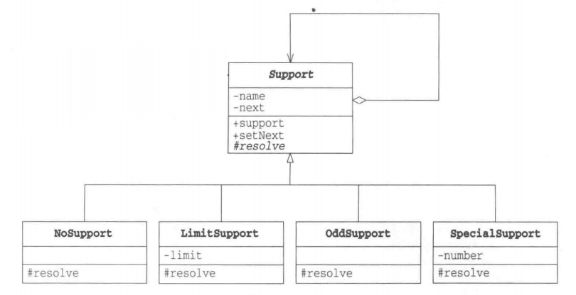

# 责任链模式

## 概述

&emsp;责任链（Chain Of Responsibility）模式为请求**创建了一个接收者对象的链**。这种模式给予请求的类型，对请求的发送者和接收者进行解耦。

> 注意：此请求并非特指网络请求，而是客户端发起执行某一操作命令。而责任链就是解决这一命令的全过程。

## 类型

&emsp;责任链模式属于行为型模式。

## 介绍

- **目的**：避免请求发送者与接收者耦合在一起，让多个对象都有可能接收请求，将这些对象连接成一条链，并且沿着这条链传递请求，直到有对象处理它为止。
- **主要解决**：责任链上的处理者负责处理请求，客户只需要将请求发送到责任链上即可，无须关心请求的处理细节和请求的传递，所以责任链将请求的发送方和处理方进行了解耦。
- **应用场景**：在一个操作执行过程中，存在很多的过滤操作就可以使用责任链模式。

## 示例代码

&emsp;这里我们以解决问题来演示下责任链模式。

### Trouble类

&emsp;Trouble类表示发生的问题，具有一个number属性，该属性表示问题的编号。

```java
package chainOfResponsibility;

public class Trouble {
    private int number;
    public Trouble(int number){
        this.number = number;
    }
    public int getNumber(){
        return number;
    }
    public String toString(){
        return "[Trouble " + number + "]";
    }
}
```

### Support抽象类

&emsp;Support是用来解决问题的抽象类，它是责任链上的对象，用于处理问题。在该抽象类中，有`next`属性、`resolve`方法和`support`方法，support方法会调用resolve方法，当resolve返回false，则support会将问题转给下一个对象，即next。

```java
package chainOfResponsibility;

public abstract class Support {
    private String name;
    private Support next;
    public Support(String name){
        this.name = name;
    }
    public Support setNext(Support next){
        this.next = next;
        return next;
    }

    public String toString(){
        return "[" + name + "]";
    }

    public final void support(Trouble trouble){
        if(resolve(trouble)){
            done(trouble);
        }else if (next != null){
            next.support(trouble);
        }else {
            fail(trouble);
        }
    }

    protected abstract boolean resolve(Trouble trouble);
    private void done(Trouble trouble){
        System.out.println(trouble + " is resolved by " + this + ".");
    }
    protected void fail(Trouble trouble){
        System.out.println(trouble + " cannot be resolved.");
    }
}
```

### NoSupport类

&emsp;NoSupport类是解决问题的具体类，它解决问题的策略是什么也不做，将问题交给下一个Support类。

```java
package chainOfResponsibility;

public class NoSupport extends Support{
    public NoSupport(String name) {
        super(name);
    }

    @Override
    protected boolean resolve(Trouble trouble) {
        // 返回false，意味着这个问题在这个Support中没有被解决
        return false;
    }
}
```

### LimitSupport类

&emsp;LimitSupport类可以解决问题编号小于limit的问题。

```java
package chainOfResponsibility;

public class LimitSupport extends Support{

    private int limit;

    public LimitSupport(String name,int limit) {
        super(name);
        this.limit = limit;
    }
    
    @Override
    protected boolean resolve(Trouble trouble) {
        // 当编号小于limit时，这个问题会在当前的Support中被解决
        return trouble.getNumber() < limit;
    }
}
```

### OddSupport类

&emsp;OddSupport类可以解决问题编号为奇数的问题。

```java
package chainOfResponsibility;

public class OddSupport extends Support{

    public OddSupport(String name) {
        super(name);
    }

    @Override
    protected boolean resolve(Trouble trouble) {
        return trouble.getNumber() % 2 == 1;
    }
}
```

### SpecialSupport类

&emsp;SpecialSupport类用于解决特定编号的问题。

```java
package chainOfResponsibility;

public class SpecialSupport extends Support{
    private int number;

    public SpecialSupport(String name,int number) {
        super(name);
        this.number = number;
    }

    @Override
    protected boolean resolve(Trouble trouble) {
        return trouble.getNumber() == number;
    }
}
```

&emsp;测试程序及运行结果如下：

```java
package chainOfResponsibility;

import org.junit.Test;

public class ChainOfResponsibilityTest {
    @Test
    public void chainOfResponsibilityTest(){
        // 创建多个解决问题的对象
        NoSupport teacher = new NoSupport("Teacher");
        LimitSupport csdn = new LimitSupport("CSDN", 5);
        SpecialSupport friend = new SpecialSupport("friend", 6);
        OddSupport baidu = new OddSupport("BaiDu");
        LimitSupport google = new LimitSupport("Google", 20);
        // 使用这些对象设置一条责任链
        teacher.setNext(friend).setNext(baidu).setNext(csdn).setNext(google);
        // 制造一些问题进行解决
        for (int i = 0; i < 21; i++) {
            teacher.support(new Trouble(i));
        }
    }
}
```

```text
[Trouble 0] is resolved by [CSDN].
[Trouble 1] is resolved by [BaiDu].
[Trouble 2] is resolved by [CSDN].
[Trouble 3] is resolved by [BaiDu].
[Trouble 4] is resolved by [CSDN].
[Trouble 5] is resolved by [BaiDu].
[Trouble 6] is resolved by [friend].
[Trouble 7] is resolved by [BaiDu].
[Trouble 8] is resolved by [Google].
[Trouble 9] is resolved by [BaiDu].
[Trouble 10] is resolved by [Google].
[Trouble 11] is resolved by [BaiDu].
[Trouble 12] is resolved by [Google].
[Trouble 13] is resolved by [BaiDu].
[Trouble 14] is resolved by [Google].
[Trouble 15] is resolved by [BaiDu].
[Trouble 16] is resolved by [Google].
[Trouble 17] is resolved by [BaiDu].
[Trouble 18] is resolved by [Google].
[Trouble 19] is resolved by [BaiDu].
[Trouble 20] cannot be resolved.
```

&emsp;类图如下：



## 责任链模式中的角色

- **Handler**: Handler角色定义了处理请求的接口。Handler知道下一个处理者是谁，如果自己无法处理该请求，它就会将该请求转给下一个处理者。在上述示例中，Support扮演着这一角色，其中处理请求操作的是support方法。
- **ConcreteHandler**:ConcreteHandler是负责处理请求的具体角色。在上述示例中，NoSupport、LimitSupport、OddSupport和SpecialSupport均扮演着这一角色。

## 其它

&emsp;责任链模式在Java Web中被广泛使用。