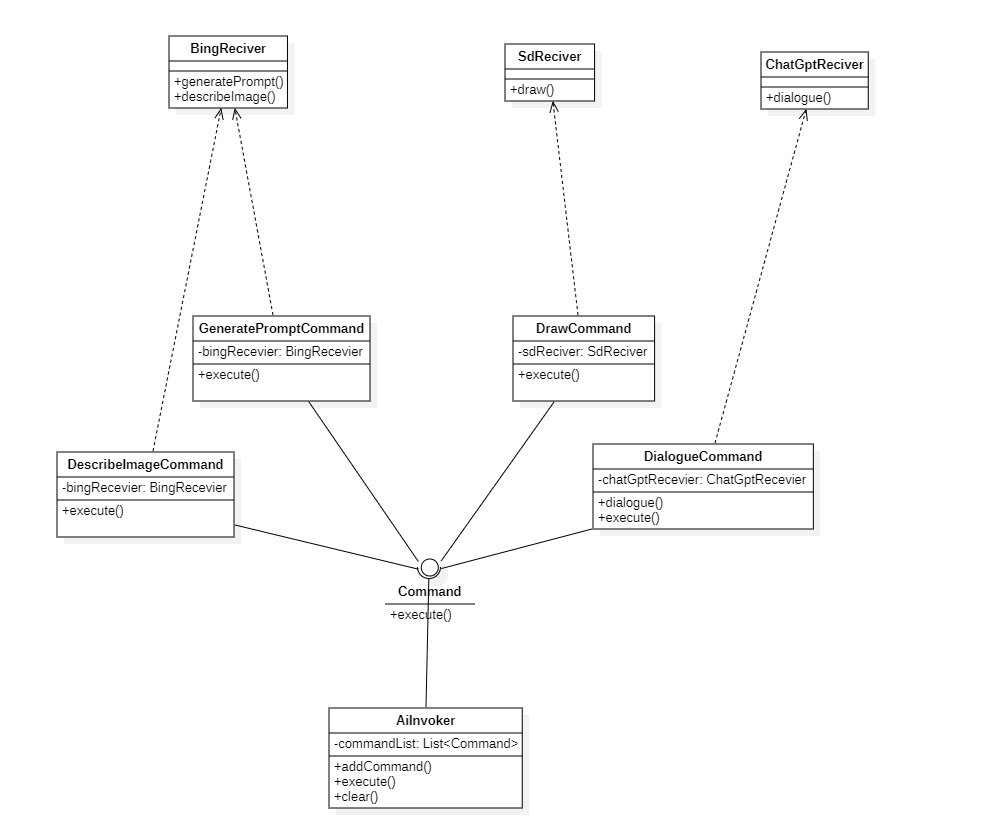
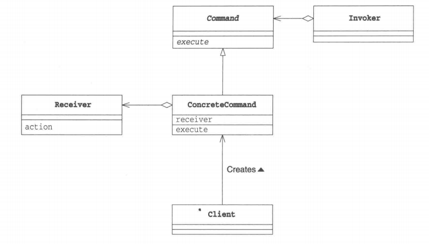

# 命令模式

## 概述

&emsp;命令模式（Command Pattern）是一种数据驱动的设计模式，它将请求以命令的形式包裹在对象中，并传给调用对象。调用对象寻找可以处理该命令的合适的对象，并把该命令传给相应的对象，该对象执行命令。

## 类型

&emsp;命令模式属于行为型模式。

## 介绍

- **目的**：将一个请求封装成一个对象，从而使您可以用不同的请求对客户进行参数化。
- **主要解决**：在软件系统中，行为请求者与行为实现者通常是一种紧耦合的关系，但某些场合，比如需要对行为进行记录、撤销或重做、事务等处理时，这种无法抵御变化的紧耦合的设计就不太合适。
- **使用场景**：当我们需要将行为请求者与行为执行者进行解耦时，就可以使用命令模式。
- **解决策略**：通过调用者调用命令接受者执行命令。

## 示例代码

&emsp;以目前的AI大模型为例，我们用ChatGpt进行简单的对话，用Bing对图片进行描述和Prompt提示词生成，用Stable Diffusion绘制图片等待。我们可以将这些AI的相关使用单独作为命令类使用。

### ChatGptReceiver类

&emsp;ChatGptReceiver作为执行ChatGpt相关操作的命令接受者，在这里我们假设只用于进行对话。

```java
package command;

public class ChatGptReceiver {
    public void dialogue(){
        System.out.println("用户与ChatGPT进行对话");
    }
}
```

### BingReceiver类

&emsp;BingReceiver作为执行Bing相关操作的命令接受者，在这里我们假设只用于图片描述和prompt提示词生成。

```java
package command;

public class BingReceiver {
    public void describeImage(){
        System.out.println("Bing 对图片进行了分析与描述.");
    }
    public void generatePrompt(){
        System.out.println("Bing根据用户的绘图需求，提供了相关的Prompt.");
    }
}
```

### SdReceiver类

&emsp;SdReceiver作为执行Stable Diffusion相关操作的命令接受者，在这里我们假设只用于图片生成。

```java
package command;

public class SdReceiver {
    public void draw(){
        System.out.println("Stable Diffusion 根据文本绘制了一幅画！");
    }
}
```

### Command接口

&emsp;Command接口定义了Command类的相关操作，具体的执行操作交给子类实现。

```java
package command;

public interface Command {
    void execute();
}
```

### DialogueCommand类

&emsp;具体执行对话的命令类。

```java
package command;

public class DialogueCommand implements Command{
    private ChatGptReceiver chatGpt;

    @Override
    public void execute() {
        chatGpt.dialogue();
    }

    public DialogueCommand(ChatGptReceiver chatGpt){
        this.chatGpt = chatGpt;
    }
}
```

### GeneratePromptCommand类

&emsp;具体生成提示词的命令类。

```java
package command;

public class GeneratePromptCommand implements Command{

    private BingReceiver bingReceiver;
    public GeneratePromptCommand(BingReceiver bingReceiver){
        this.bingReceiver = bingReceiver;
    }

    @Override
    public void execute() {
        bingReceiver.generatePrompt();
    }
}
```

### DrawCommand类

&emsp;具体执行画图的命令类。

```java
package command;

public class DrawCommand implements Command{

    private SdReceiver sdReceiver;
    public DrawCommand(SdReceiver sdReceiver){
        this.sdReceiver = sdReceiver;
    }

    @Override
    public void execute() {
        sdReceiver.draw();
    }
}
```

### DescribeImageCommand类

&emsp;具体对图片进行描述的命令类。

```java
package command;

public class DescribeImageCommand implements Command{
    private BingReceiver bingReceiver;
    public DescribeImageCommand(BingReceiver bingReceiver){
        this.bingReceiver = bingReceiver;
    }
    @Override
    public void execute() {
        bingReceiver.describeImage();
    }
}
```

### AiInvoker类

&emsp;具体的命令调用者类。

```java
package command;

import java.util.ArrayList;
import java.util.List;

public class AiInvoker {
    private List<Command> commandList = new ArrayList<>();
    public void addCommand(Command command){
        commandList.add(command);
    }
    public void execute(){
        commandList.forEach(Command::execute);
    }
    public void clear(){
        commandList.clear();
    }
}
```

&emsp;测试代码及运行结果如下：

```java
package command;

import org.junit.Test;

/**
 * ClassName: CommandTest <br/>
 *
 * @author Ning <br/>
 * @date 2023/10/22 0022
 * @since JDK 11
 */
public class CommandTest {
    @Test
    public void commandTest(){
        // 创建命令接受者
        BingReceiver bingReceiver = new BingReceiver();
        ChatGptReceiver chatGptReceiver = new ChatGptReceiver();
        SdReceiver sdReceiver = new SdReceiver();
        // 创建具体的命令类
        Command dialogueCommand = new DialogueCommand(chatGptReceiver);
        Command generatePromptCommand = new GeneratePromptCommand(bingReceiver);
        Command drawCommand = new DrawCommand(sdReceiver);
        Command describeImageCommand = new DescribeImageCommand(bingReceiver);
        // 创建具体的命令调用者
        AiInvoker aiInvoker = new AiInvoker();
        // 将命令加入调用列表中
        aiInvoker.addCommand(dialogueCommand);
        aiInvoker.addCommand(generatePromptCommand);
        aiInvoker.addCommand(drawCommand);
        aiInvoker.addCommand(describeImageCommand);
        // 执行
        aiInvoker.execute();
        // 清空命令列表
        aiInvoker.clear();
    }
}
```

```text
用户与ChatGPT进行对话
Bing根据用户的绘图需求，提供了相关的Prompt.
Stable Diffusion 根据文本绘制了一幅画！
Bing 对图片进行了分析与描述.
```

&emsp;类图如下：



## 命令模式中的角色

- **Command**:Command角色负责定义命令的接口。在上述示例中，`Command`扮演着这一角色。
- **ConcreteCommand**：ConcreteCommand角色是具体的Command，负责实现Command角色中定义的接口。在上述示例中，`DialogueCommand`、`GeneratePromptCommand`、`DrawCommand`和`DescribeImageCommand`均扮演着这一角色。
- **Receiver**：Receiver角色是Command角色执行命令时的对象，又称为命令接受者。在上述示例中，`ChatGptReceiver`、`BingReceiver`和`SdReceiver`。
- **Invoker**：Invoker角色是负责执行命令的角色，它会调用Command角色中定义的接口。在上述示例中，`AiInvoker`扮演着这一角色。
- **Client**：Client负责生成Command角色和分配Receiver角色，在上述示例中，测试代码扮演着这一角色。



## 其它

&emsp;命令模式可以说将封装发挥得淋漓尽致。在我们平时的程序设计中，最常用的封装是将拥有一类职责的对象封装成类，而命令对象的唯一职责就是通过 execute 去调用一个方法，也就是说它将 “方法调用” 这个步骤封装起来了，使得我们可以对 “方法调用” 进行排队、撤销等处理。

