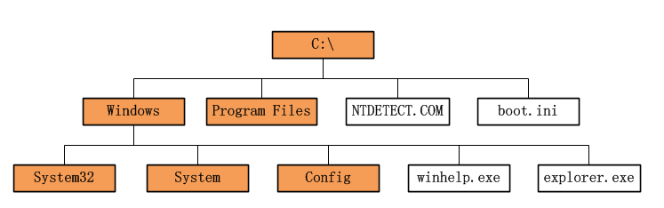
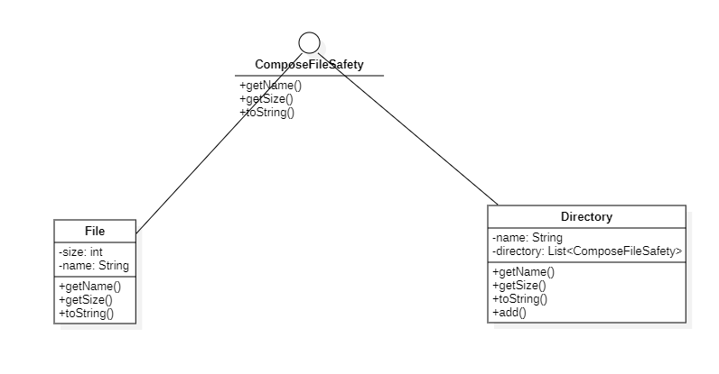
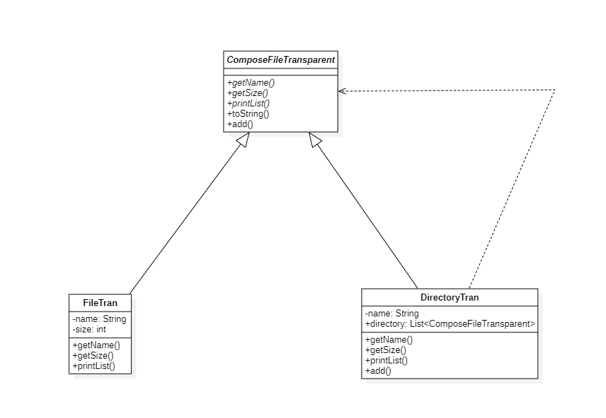

# 组合模式

## 概述

&esmp;组合(Composite)模式又称为“部分-整体”模式，是用于**把一组相似的对象当作一个单一的对象**。组合模式依据树形结构来组合对象，用来表示部分以及整体层次。

&emsp;树结构在过程性编程语言中曾发挥了巨大作用，而在面向对象的语言中，树结构的威力也同样巨大。一个基于继承的类型的等级结构便是一个树结构；一个基于组合的对象结构也是一个树结构。组合模式就是一个处理对象的树机构模式。

## 类型

&emsp;组合模式属于结构型模式，它创建了对象组的树形结构。

## 介绍

- **目的**：将对象组合成树形结构以表示“部分-整体”的层次结构。组合模式使得用户对单个对象和组合对象的使用具有一致性。
- **主要解决**：组合模式在树型结构的问题中，模糊了简单元素和复杂元素的概念，客户端可以像处理简单元素一样来处理复杂元素，从而使得**客户端与复杂元素的内部结构解耦**。
- **使用场景**：当你想表示对象的部分-整体层次结构时；希望用户忽略组合对象与单个对象的不同，用户将统一地使用组合结构中的所有对象。
- **解决方案**：树枝与叶子实现统一接口，树枝内部组合该接口。

## 示例代码

&emsp;这里以文件系统为例，文件系统是一个经典的树型结构，在文件系统中，多个文件组成一个文件夹，文件夹下也有可能存在多个文件夹。在该系统中，普通文件就是一个简单元素，属于部分；而文件夹就属于整体。



&emsp;我们需要定义部分与整体的共同抽象类:`ComposeFile`,然后分别定义：`File`和`Directory`表示文件和文件夹，并让这些类继承它们共同的抽象类`ComposeFile`。

&emsp;在组合模式中，根据所实现的抽象类的区别分为两种形式，分别为：`安全式`和`透明式`。

### 安全式

&emsp;安全模式的组合模式要求**管理组合元素的方法只出现在树枝构件类中，而不出现在树叶构件类中**。因此抽象类`ComposeFile`中只需定义`File`和`Directory`的共同部分即可，对于组合元素的相关方法，由Directory内部自己实现。

&emsp;在本示例中，对组合元素的方法只有一个：add(),该方法用于向组合元素中添加简单元素。按照安全式组合元素的概念，我们需要将add的声明及实现定义在Directory中。

#### ComposeFileSafety接口

```java
package composite;

public interface ComposeFileSafety {
    // 无论文件还是文件夹 都有一个名称 该方法用于返回文件或文件夹的名称
    String getName();
    // 返回文件或文件夹的大小
    int getSize();
    // 用于打印树型结构
    void printList(String prefix);
}
```

#### File类

```java
package composite;

public class File implements ComposeFileSafety {

    private String name;
    private int size;

    public File(String name, int size) {
        this.name = name;
        this.size = size;
    }

    @Override
    public String getName() {
        return name;
    }

    @Override
    public int getSize() {
        return size;
    }

    @Override
    public void printList(String prefix) {
        System.out.println(prefix + "/" + this);
    }

    // 当返回对象(this)时，会返回toString返回的字符串
    public String toString() {
        return getName() + " (" + getSize() + ")";
    }
}
```

#### Directory类

```java
package composite;

import java.util.ArrayList;
import java.util.Iterator;
import java.util.List;

public class Directory implements ComposeFileSafety {
    private String name;
    // 用于存放简单元素
    private List<ComposeFileSafety> directory = new ArrayList<>();

    public Directory(String name) {
        this.name = name;
    }

    @Override
    public String getName() {
        return name;
    }

    @Override
    public int getSize() {
        int size = 0;
        Iterator<ComposeFileSafety> iterator = directory.iterator();
        while (iterator.hasNext()) {
            ComposeFileSafety next = iterator.next();
            size += next.getSize();
        }
        return size;
    }

    @Override
    public void printList(String prefix) {
        System.out.println(prefix + "/" + this);
        Iterator<ComposeFileSafety> iterator = directory.iterator();
        while (iterator.hasNext()) {
            ComposeFileSafety next = iterator.next();
            next.printList(prefix + "/" + name);
        }
    }

    // 对组合元素进行操作的方法定义在Directory中
    public ComposeFileSafety add(ComposeFileSafety file) {
        directory.add(file);
        return this;
    }

    public String toString() {
        return getName() + " (" + getSize() + ")";
    }
}
```

&emsp;测试代码如下：

```java
package composite;

import org.junit.Test;

public class ComposeTest {
    @Test
    public void composeTest(){
        Directory rootDir = new Directory("root");
        Directory binDir = new Directory("bin");
        Directory tmpDir = new Directory("tmp");
        Directory usrDir = new Directory("usr");
        Directory ningDir = new Directory("ning");
        File file = new File("get-docker.sh", 100);
        File python = new File("python", 200);
        rootDir.add(binDir);
        rootDir.add(tmpDir);
        rootDir.add(usrDir);
        usrDir.add(ningDir);
        binDir.add(python);
        ningDir.add(file);
        rootDir.printList("");
    }
}
```

```text
/root (300)
/root/bin (200)
/root/bin/python (200)
/root/tmp (0)
/root/usr (100)
/root/usr/ning (100)
/root/usr/ning/get-docker.sh (100)
```

类图如下：



> 在类图中我们可以看到，对组合元素的操作add我们定义在Directory中，这是安全式组合模式的一个表现。

### 透明式

&emsp;透明式的组合模式要求所有的具体类的所有操作均由一个抽象类定义。也就是说对于组合元素的操作我们也需要声明在抽象类中。

#### ComposeFileTransparent抽象类

```java
package composite;

public abstract class ComposeFileTransparent {
    public abstract String getName();

    public abstract int getSize();

    // 该方法是对组合对象的操作方法，考虑到简单元素不具备这种方法，因此我们可以在父类中先定义为异常操作，组合元素通过重写完成组合对象的操作即可
    public ComposeFileTransparent add(ComposeFileTransparent composeFileTransparent) throws Exception {
        throw new Exception();
    }

    public abstract void printList(String prefix);

    public String toString() {
        return getName() + " (" + getSize() + ")";
    }
}
```

> 在上述抽象类中我们将add操作定义为异常操作，这样我们在简单元素的子类中就不必实现该方法了，而在组合元素的子类中通过重写即可。

#### FileTran类

&emsp;简单元素子类。

```java
package composite;

public class FileTran extends ComposeFileTransparent{
    private String name;
    private int size;

    public FileTran(String name,int size){
        this.name = name;
        this.size = size;
    }

    @Override
    public String getName() {
        return name;
    }

    @Override
    public int getSize() {
        return size;
    }

    @Override
    public void printList(String prefix) {
        System.out.println(prefix + "/" + this);
    }
}
```

#### DirectoryTran

&emsp;复杂元素子类。

```java
package composite;

import java.util.ArrayList;
import java.util.Iterator;
import java.util.List;

public class DirectoryTran extends ComposeFileTransparent{

    private List<ComposeFileTransparent> directory = new ArrayList<>();
    private String name;

    @Override
    public String getName() {
        return name;
    }

    public DirectoryTran(String name){
        this.name = name;
    }

    @Override
    public int getSize() {
        Iterator<ComposeFileTransparent> iterator = directory.iterator();
        int size = 0;
        while (iterator.hasNext()){
            ComposeFileTransparent next = iterator.next();
            int nextSize = next.getSize();
            size += nextSize;
        }
        return size;
    }

    @Override
    public void printList(String prefix) {
        System.out.println(prefix + "/" + this);

        for (Iterator<ComposeFileTransparent> iterator = directory.iterator();iterator.hasNext();){
            ComposeFileTransparent next = iterator.next();
            next.printList(prefix + "/" + name);
        }
    }
    public ComposeFileTransparent add(ComposeFileTransparent composeFileTransparent){
        directory.add(composeFileTransparent);
        return this;
    }
}
```

&emsp;测试代码及运行结果如下：

```java
package composite;

import org.junit.Test;

/**
 * ClassName: ComposeTest <br/>
 *
 * @author Ning <br/>
 * @date 2023/10/16 0016
 * @since JDK 11
 */
public class ComposeTest {
    @Test
    public void composeTranTest() throws Exception {
        DirectoryTran rootDir = new DirectoryTran("root");
        DirectoryTran binDir = new DirectoryTran("bin");
        DirectoryTran tmpDir = new DirectoryTran("tmp");
        DirectoryTran usrDir = new DirectoryTran("usr");
        DirectoryTran ningDir = new DirectoryTran("ning");
        FileTran file = new FileTran("get-docker.sh", 100);
        FileTran python = new FileTran("python", 200);
        rootDir.add(binDir);
        rootDir.add(tmpDir);
        rootDir.add(usrDir);
        usrDir.add(ningDir);
        binDir.add(python);
        ningDir.add(file);
        rootDir.printList("");
    }
}
```

```text
/root (300)
/root/bin (200)
/root/bin/python (200)
/root/tmp (0)
/root/usr (100)
/root/usr/ning (100)
/root/usr/ning/get-docker.sh (100)
```

类图如下：



## Composite模式中的角色

- **Leaf**: 简单理解为：表示简单元素的角色，在该角色中不能放入其它对象。在上述示例中，`File`和`FileTran`均扮演这一角色。
- **Composite**：简单理解为：表示组合元素的角色，在该角色中可以放入`Leaf`对象。在上述示例中，`Directory`和`DirectoryTran`均扮演这一角色。
- **Component**：使Leaf和Composite两者具有一致性，简单理解为Component是Leaf和Composite的父类。在上述示例中，`ComposeFileSafety`和`ComposeFileTransparent`均扮演这一角色。

## 其它

在组合模式中，安全性与透明性分别指：

- 安全性：**从客户端使用组合模式上看是否更安全，如果是安全的，那么就不会发生误操作的可能，能访问的方法都是被支持的。**
- 透明性：**从客户端使用组合模式上看，是否需要区分到底是树枝对象还是树叶对象，即是组合元素还是简单元素。如果是透明的，那么就不做区分，对于客户端而言，均是Compoent对象，具体的类型对于客户端而言是透明的，是无须关心的。**

&emsp;对于组合模式而言，在安全性和透明性上，会**更看重透明性**，毕竟组合模式的目的是：**让客户端不再区分是树枝对象还是树叶对象，而是以统一的方式进行操作**。因此在使用组合模式时，建议多采用透明性的实现方式。
