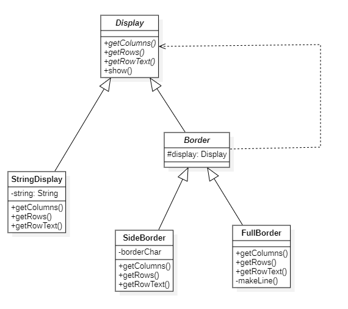
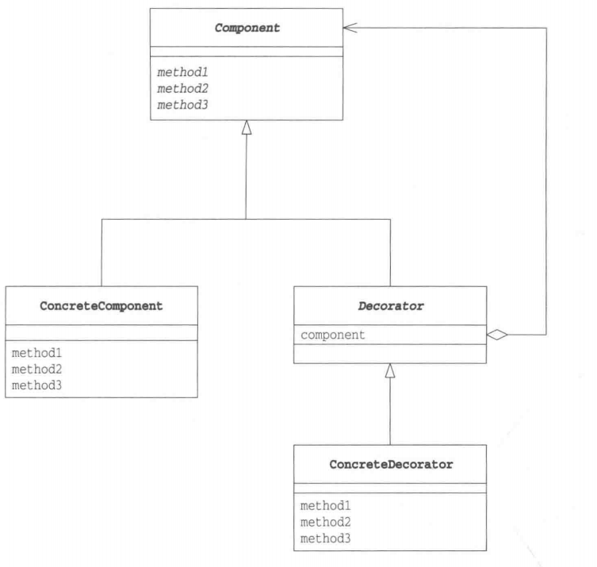

# 装饰器模式

## 概述

&emsp;装饰器（Decorator）模式允许向一个现有的对象添加新的功能，同时又不改变其结构。它是作为现有类的一个包装。

&emsp;装饰器模式通过将对象包装在装饰器类中，以便动态地修改其行为。

## 类型

&emsp;装饰器模式模式属于结构型模式。

## 介绍

- **目的**：动态地给一个对象添加一些额外的职责。就增加功能来说，装饰器模式相比通过继承父类的子类来说更为灵活。
- **主要解决**：我们在扩展一个类时普遍使用继承方式实现，但由于继承为类引入静态特征，并且随着扩展功能的增多，子类会很膨胀。而装饰器模式就可以解决这一点。
- **使用场景**：不想增加很多子类，但需要扩展类的功能。

## 示例代码

&emsp;这里以一段程序为例，该程序的功能是给一段文字添加装饰边框。这里的边框是指用“-”、“+”和“|”字符组成的边框。

```text
+-----------+
|Hello,Java!|
+-----------+
```

### Display抽象类

&emsp;该类的含义是用于显示字符串的抽象类，在该类中，定义了三个抽象方法：`getColumns`、`getRows`、`getRowText`，功能是：获取横向字符串、获取纵向行数和获取第row行的字符串，同时使用了模板方法模式，实现了一个`show`方法，该方法会调用这三个抽象方法。

```java
package decorator;

public abstract class Display {
    abstract int getColumns(); // 获取列数（横向的字符数）
    abstract int getRows(); // 获取行数
    abstract String getRowText(int row);
    public final void show(){
        for (int i = 0; i < getRows(); i++) {
            System.out.println(getRowText(i));
        }
    }
}
```

### StringDisplay类

&emsp;该类是Display的子类，用于显示单行字符串的类，它需要实现Display抽象类中声明的抽象方法。由于StringDisplay是用于显示一行字符串，因此它的getColumns返回的是字符串的长度，getRows返回1。

```java
package decorator;

public class StringDisplay extends Display{

    private String string;

    public StringDisplay(String string){
        this.string = string;
    }

    @Override
    int getColumns() {
        return string.length();
    }

    @Override
    int getRows() {
        return 1;
    }

    @Override
    String getRowText(int row) {
        if(row == 0){
            return string;
        }else {
            return null;
        }
    }
}
```

### Border抽象类

&emsp;Border抽象类是装饰边框的抽象类，同时它也是Display的子类。这意味着**装饰边框与被装饰物具有了相同的方法**。从接口角度而言，装饰边框与被装饰物具有相同的方法，这也就意味着它们具有一致性。

```java
package decorator;

public abstract class Border extends Display {
    private Display display;
    public Border(Display display){
        this.display = display;
    }
}
```

### SideBorder类

&emsp;SideBorder类是一种具体的装饰边框类，是Border类的子类。在这个装饰类中，它用于指定某一字符装饰字符串的左右两侧。

```java
package decorator;

public class SideBorder extends Border{

    private char borderChar;

    public SideBorder(Display display,char borderChar){
        super(display);
        this.borderChar = borderChar;
    }

    @Override
    int getColumns() {
        return 1 + display.getColumns() + 1;
    }

    @Override
    int getRows() {
        return display.getRows();
    }

    @Override
    String getRowText(int row) {
        return borderChar + display.getRowText(row) + borderChar;
    }
}
```

### FullBorder类

&emsp;FullBorder类与SideBorder类一样，也是Border类的子类。FullBorder类会在字符串的上下左右都加上装饰边框，而在FullBorder类中，边框的字符是固定的。同时内部还额外声明了一个makeLine方法，该方法可以连续地显示某个指定的字符。

```java
package decorator;

public class FullBorder extends Border{

    public FullBorder(Display display){
        super(display);
    }

    @Override
    int getColumns() {
        return 1 + display.getColumns() + 1;
    }

    @Override
    int getRows() {
        return 1 + display.getRows() + 1;
    }

    @Override
    String getRowText(int row) {
        if (row == 0){
            return "+" + makeLine('-',display.getColumns()) + "+";
        }else if (row == display.getRows() + 1){
            return "+" + makeLine('-',display.getColumns()) + "+";
        }else {
            return "|" + display.getRowText(row - 1) + "|";
        }
    }

    private String makeLine(char ch,int count){
        StringBuffer buf = new StringBuffer();
        for (int i = 0; i < count; i++) {
            buf.append(ch);
        }
        return buf.toString();
    }
}
```

&emsp;测试代码及运行结果如下：

```java
package decorator;

import org.junit.Test;

public class DecoratorTest {
    @Test
    public void decoratorTest(){
        Display s1 = new StringDisplay("Hello World!");
        Display s2 = new SideBorder(s1, '$');
        Display s3 = new FullBorder(s2);
        s1.show();
        s2.show();
        s3.show();

        Display s4 = new StringDisplay("Hello Java!");
        // 给s4左右两边加$符号
        s4 = new SideBorder(s4, '$');
        // 再给s4加两层全边框
        s4 = new FullBorder(s4);
        s4 = new FullBorder(s4);
        // 再给s4两边加一次'/'符号、两次$符号
        s4 = new SideBorder(s4,'/');
        s4 = new SideBorder(s4,'$');
        s4 = new SideBorder(s4,'$');
        // 在给s4加一层全边框
        s4 = new FullBorder(s4);
        s4.show();
    }
}
```

```text
Hello World!
$Hello World!$
+--------------+
|$Hello World!$|
+--------------+
+-----------------------+
|$$/+---------------+/$$|
|$$/|+-------------+|/$$|
|$$/||$Hello Java!$||/$$|
|$$/|+-------------+|/$$|
|$$/+---------------+/$$|
+-----------------------+
```

&emsp;类图如下



## 装饰器模式中的角色

- **Component**:增加功能时的核心角色，该角色定义了被装饰对象和装饰器对象的公共接口抽象类。上述示例中，`Display`扮演着这一角色。
- **ConcreteComponent**：具体的被装饰对象。`StringDisplay`扮演着这一角色。
- **Decorator**：该角色具有与Component角色相同的接口。在它内部保存了被装饰对象实例，也就是说，Decorator知道自己需要装饰的对象。`Border`扮演着这一角色。
- **ConcreteDecorator**：该角色是具体的装饰类。`SideBorder`和`FullBorder`类均扮演着这一角色。



## 其它

&emsp;装饰器模式通过嵌套包装多个装饰器对象，可以实现多层次的功能增强。每个具体装饰器类都可以选择性地增加新的功能，同时保持对象接口的一致性。