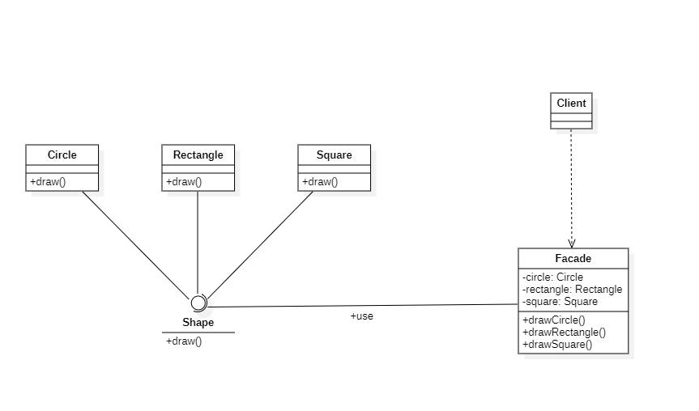
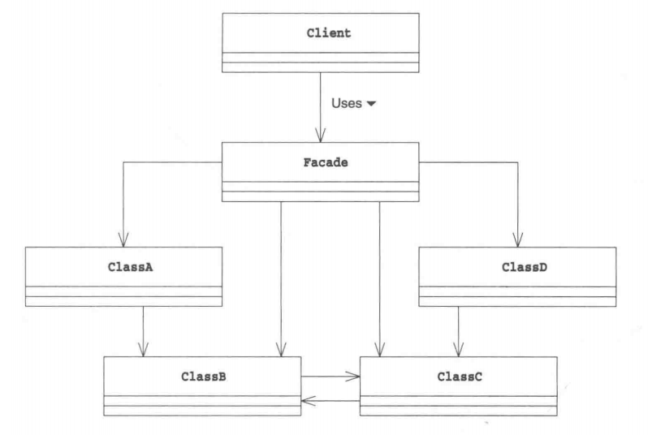

# 外观模式

## 概述

&emsp;外观(Facade)模式用于隐藏系统的复杂性，并向客户端提供了一个客户端可以访问系统的接口。简而言之，这是对系统的再次封装。

## 类型

&emsp;外观模式属于结构型模式。

## 介绍

- **目的**：为子系统中的一组接口提供一个一致的界面，外观模式定义了一个更高层的接口，这个接口使得这一子系统更加容易使用。
- **主要解决**：降低访问复杂系统的内部子系统时的复杂度，简化客户端之间的接口。
- **应用场景**：当客户端不需要知道系统内部的复杂联系，整个系统只需提供一个“接待员”时就可以使用外观模式。

## 示例代码

&emsp;这里以绘制各种图形为例，介绍下外观模式的实现。

### Shape接口

&emsp;Shape接口定义了对各种图形的操作，其中有一个绘制图形的操作：`draw()`

```java
package facade;

public interface Shape {
    void draw();
}
```

### Circle类

&emsp;表示圆类，该类实现了Shape接口。

```java
package facade;

public class Circle implements Shape{
    @Override
    public void draw() {
        System.out.println("Draw a circle!");
    }
}
```

### Rectangle类

```java
package facade;

public class Rectangle implements Shape{
    @Override
    public void draw() {
        System.out.println("Draw a rectangle!");
    }
}
```

### Square类

```java
package facade;

public class Square implements Shape{
    @Override
    public void draw() {
        System.out.println("Draw a square!");
    }
}
```

### Facade类

&emsp;这个类就是外观模式的具体实现类，它统一了各种图形的操作。

```java
package facade;

public class Facade {
    private Circle circle;
    private Rectangle rectangle;
    private Square square;
    
    public Facade(){
        circle = new Circle();
        rectangle = new Rectangle();
        square = new Square();
    }
    
    public void drawCircle(){
        circle.draw();
    }
    
    public void drawRectangle(){
        rectangle.draw();
    }
    
    public void drawSquare(){
        square.draw();
    }
}
```

&emsp;测试代码及运行结果如下：

```java
package facade;

import org.junit.Test;

public class FacadeTest {
    @Test
    public void facadeTest(){
        Facade facade = new Facade();
        facade.drawCircle();
        facade.drawRectangle();
        facade.drawSquare();
    }
}
```

```text
Draw a circle!
Draw a rectangle!
Draw a square!
```

&emsp;类图如下：



## 外观模式中的角色

- **Facade**：Facade角色是代表构成系统的其它角色的窗口，它向系统外部提供该系统的最高层API用于执行系统内部的各种操作。在上述示例中，Facade扮演着这一角色。
- **Subsystem**：Subsystem角色代表一个系统，在该系统中有很多的角色，同时对外提供很多API操作该系统内部的各个角色。在上述示例中，Shape、Circle、Rectangle和Square共同组成了一个子系统，扮演着这一角色。
- **Client**：Client角色负责调用Facade角色来达到操作Subsystem的目的。上述示例中，我们的测试代码就扮演着这一角色。

> 需要说明的是，Client并不包含在Facade模式中，而且即使没有Facade角色，Client也可以对Subsystem进行操作，Facade的作用就是对Subsystem的相关操作进行再次封装。



## 其它

- 外观模式：**外部与一个子系统的通信必须通过一个统一的外观对象进行，为子系统中的一组接口提供一个一致的界面，外观模式定义了一个高层接口，这个接口使得这一子系统更加容易使用**。外观模式又称为门面模式。

&emsp;外观模式非常常用，尤其是在第三方库的设计中，我们应该提供尽量简洁的接口供别人调用。另外，在 MVC 架构中，C 层（Controller）就可以看作是外观类，Model 和 View 层通过 Controller 交互，减少了耦合。