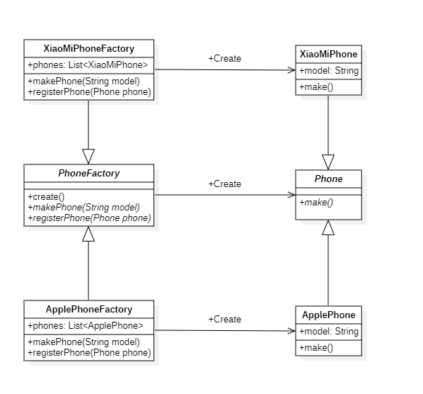
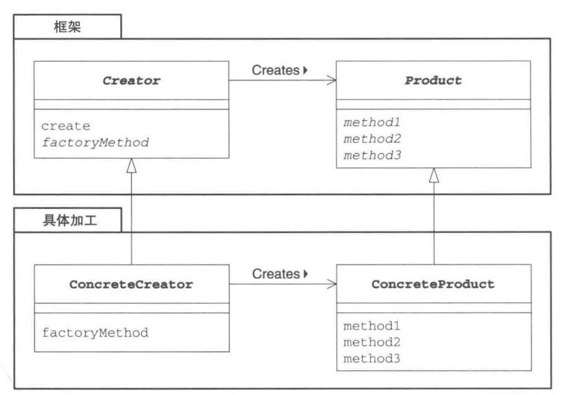

# 工厂方法模式

## 概述

&emsp;工厂方法模式与模板方法模式类似，只不过模板方法关注的是方法执行，而工厂方法模式关注的对象的创建。工厂方法的目的是**使得创建对象和使用对象是分离的，并且客户端总是引用抽象工厂和抽象产品**。

## 类型

&emsp;工厂方法模式属于创建型模式。

## 介绍

- **目的**：定义一个创建对象的接口，让其子类自己决定实例化哪一个工厂类。
- **主要解决**：主要解决接口选择的问题。
- **使用场景**：在不同的条件下需要创建不同的实例。
- **解决方案**：定义一个抽象接口用于创建抽象产品，至于如何创建，由子类进行实现。
- **注意事项**：作为一种创建类模式，在任何需要生成复杂对象的地方，都可以使用工厂方法模式。有一点需要注意的地方就是复杂对象适合使用工厂模式，而简单对象，特别是只需要通过 new 就可以完成创建的对象，无需使用工厂模式。如果使用工厂模式，就需要引入一个工厂类，会增加系统的复杂度。

## 示例代码

&emsp;这里我们以生产不同类型的手机为例。

## 需求分析

&emsp;首先，我们可以假设每个手机的生产流程是一致的，即：创建手机实例`makePhone()`，登记手机基本信息`registerPhone()`，因此，我们可以将整个生产过程抽象出来，将其作为一个手机工厂，即：`PhoneFactory`,而对应的抽象产品就是`Phone`。

&emsp;其次，对于不同的手机其具体的生产过程会有所区别的，但流程均遵循上述提到的两个过程:`makePhone()`和`registerPhone()`。假设我们要生产`ApplePhone`，那么就有一个对应的`ApplePhoneFactory`；

&emsp;最后，我们让ApplePhoneFactory和ApplePhone分别实现PhoneFactory和Phone即可。

### PhoneFactory类

```java
package factoryMethod;

public abstract class PhoneFactory {
    abstract Phone makePhone(String model);
    abstract void registerPhone(Phone phone);
    // 这一步类似于模板方法，无论哪款手机，我们的创建过程都是创建手机实例，然后在登记该手机的基本信息
    Phone create(String model){
        Phone phone = makePhone(model);
        registerPhone(phone);
        return phone;
    }
}
```

### Phone类

```java
package factoryMethod;

public abstract class Phone {
    // 无论那种型号的手机，都有一个创建完成时打印创建成功的信息
    abstract void make();
}
```

### ApplePhoneFactory类

```java
package factoryMethod;

import java.util.ArrayList;
import java.util.List;

public class ApplePhoneFactory extends PhoneFactory{
    // 用于存放注册过的手机
    private final List<ApplePhone> phones = new ArrayList<>();
    @Override
    Phone makePhone(String model) {
        ApplePhone applePhone = new ApplePhone(model);
        // 创建完成后，这里会打印创建成功的提示信息
        applePhone.make();
        return applePhone;
    }

    @Override
    void registerPhone(Phone phone) {
        // 记录过手机基本信息的手机实例 会存放在一个集合中
        phones.add((ApplePhone) phone);
        System.out.println(((ApplePhone) phone).getModel() + " is registered!");
    }
}
```

### ApplePhone类

```java
package factoryMethod;

public class ApplePhone extends Phone{
    // 手机的基本信息，这里只给出一个型号的信息
    private String model;
    public ApplePhone(String model){
        this.model = model;
    }

    public String getModel(){
        return this.model;
    }

    @Override
    void make() {
        System.out.println("phone model (" + model + ") is created");
    }
}
```

&emsp;接着我们写一下测试代码跑一跑吧！

```java
package factoryMethod;

import org.junit.Test;

public class FactoryMethodTest {
    @Test
    public void factoryMethodTest(){
        PhoneFactory applePhoneFactory = new ApplePhoneFactory();
        Phone phone10 = applePhoneFactory.create("iPhone 10");
        Phone phone11 = applePhoneFactory.create("iPhone 11");
    }
}
```

&emsp;控制台的日志如下：

```text
phone model (iPhone 10) is created
iPhone 10 is registered!
phone model (iPhone 11) is created
iPhone 11 is registered!
```

&emsp;可以看到我们创建对象是通过对应的工厂得到的，也就是创建过程不再由我们开发者控制，而是交给工厂。我们需要什么对象，就通过工厂获得，至于具体的创建过程，我们并不在乎。那么，如果现在又需要创建小米型号的手机，我们该怎么办呢？很简单，创建`XiaoMiPhoneFactory`和`XiaoMiPhone`分别实现`PhoneFactory`和`Phone`即可，代码如下：

### XiaoMiPhone类

```java
package factoryMethod;

public class XiaoMiPhone extends Phone{
    private String model;
    public XiaoMiPhone(String model){
        this.model = model;
    }
    public String getModel(){
        return this.model;
    }
    @Override
    void make() {
        System.out.println("phone model ("+model+") is created!");
    }
}
```

### XiaoMiPhoneFactory类

```java
package factoryMethod;

import java.util.ArrayList;
import java.util.List;

public class XiaoMiPhoneFactory extends PhoneFactory{

    private final List<XiaoMiPhone> phones = new ArrayList<>();
    @Override
    Phone makePhone(String model) {
        XiaoMiPhone xiaoMiPhone = new XiaoMiPhone(model);
        xiaoMiPhone.make();
        return xiaoMiPhone;
    }

    @Override
    void registerPhone(Phone phone) {
        phones.add((XiaoMiPhone) phone);
        System.out.println(((XiaoMiPhone)phone).getModel() + " is registered!");
    }
}
```

&emsp;同样的，我们可以通过测试代码跑一跑效果：

```java
package factoryMethod;

import org.junit.Test;

public class FactoryMethodTest {
    @Test
    public void factoryMethodTest(){
        PhoneFactory applePhoneFactory = new ApplePhoneFactory();
        PhoneFactory xiaoMiPhoneFactory = new XiaoMiPhoneFactory();
        // 生产两部iPhone手机
        Phone phone10 = applePhoneFactory.create("iPhone 10");
        Phone phone11 = applePhoneFactory.create("iPhone 11");
        // 生产一部XiaoMi手机
        Phone phone = xiaoMiPhoneFactory.create("xiaomi 13");
    }
}
```

&emsp;控制台日志如下：

```text
phone model (iPhone 10) is created
iPhone 10 is registered!
phone model (iPhone 11) is created
iPhone 11 is registered!
phone model (xiaomi 13) is created!
xiaomi 13 is registered!
```

## 类图



## 工厂方法中的角色

- **Product**: 即工厂生产出来的产品，是一个抽象类，它定义了在工厂方法模式中生产的那些实例所持有的接口，但具体的处理则由子类ConcreteProduct角色决定。在上述示例中，`Phone`扮演着此角色。
- **Creator**: 创建者，也即工厂，它是负责生成Product角色的抽象类，但具体的生产过程则由子类ConcreteCreator角色决定，在上述代码中,`PhoneFactory`扮演着这一角色。
- **ConcreteProduct**: 它决定了工厂生产出的具体产品，在上述代码中，`ApplePhone`和`XiaoMiPhone`扮演着这一角色。
- **ConcreteCreator**: 它负责生产具体的产品，上述代码中,`ApplePhoneFactory`和`XiaoMiPhoneFactory`扮演着这一角色。



> Creator角色对于实际负责生成实例的ConcreteCreator角色是一无所知的，它唯一知道的就是：只要调用Product角色和生成实例的方法，就可以生产出Product的实例。在上述代码中，create方法就是用于创建对象的方法。**不用new关键字来创建实例对象，而是调用创建实例对象的方法来创建对象，这样就可以防止父类与其它具体类耦合。**

## 其它

&emsp;作为一种创建类模式，在任何需要生成复杂对象的地方，都可以使用工厂方法模式。有一点需要注意的地方就是复杂对象适合使用工厂模式，而简单对象，特别是只需要通过 new 就可以完成创建的对象，无需使用工厂模式。如果使用工厂模式，就需要引入一个工厂类，会增加系统的复杂度。