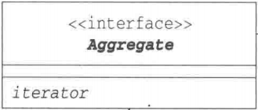
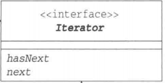
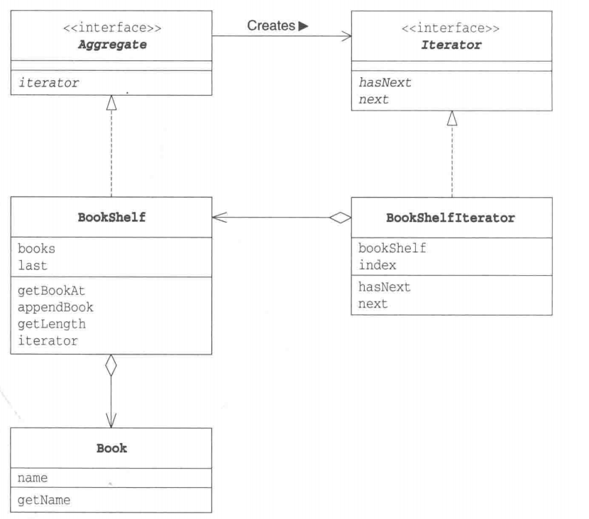

# 迭代器模式

## 概述

&emsp;迭代器摸索(Iterator Pattern)是Java和.Net编程环境中非常常用的设计模式。这种模式用于顺序访问集合对象的元素，不需要知道集合对象的底层表示。

## 类型

&emsp;迭代器模式属于行为型模式。

## 介绍

- **目的**：提供一种方法顺序访问一个聚合对象中各个元素，而又无须暴露该对象的内部表示。
- **主要解决**：不同的方式来遍历整个整合对象。
- **使用场景**：访问一个聚合对象的内容而无须暴露它的内部结构；需要为聚合对象提供多种遍历方式；为遍历不同的聚合结构提供统一的接口。
- **解决方案**：把在元素之间游走的责任交给迭代器，而不是聚合对象。
- **应用实例**：Java中的Iterator类

## 示例代码

### 需求概述

&emsp;下面给出一个简单的代码示例，其功能是：将多本书(Book)放置在一个书架(BookShelf)上，并顺序输出书架上的每一本书的书名。

### 需求分析

&emsp;在上述需求中，书架是我们的迭代对象，也就是我们的聚合对象或整合对象；书是我们迭代对象中的元素，也就是聚合对象中的基本单元。在实现上述需求前，我们需要先设计统一接口，便于后续扩展与维护。

&emsp;对于聚合对象，它应该有Aggregate接口，它用于表示集合，对于每个集合，它应该返回迭代自己的迭代器，因此，我们就可以轻松得到Aggregate接口的类图：



&emsp;对于每一个迭代器，它也有一个接口，名为Iterator，它应该具有两个基本的方法:**next()**和**hasNext()**。

- **next()**: 返回当前元素，并将迭代指针指向下一个元素；
- **hasNext()**: 简单理解为判断能否调用next()方法



&emsp;后面在实现这一需求时，我们只需让迭代对象实现Aggregate接口，让迭代对象的某一个迭代器（迭代方式）实现Iterator接口即可。

### UML类图



### 代码实现

&emsp;我们先把Aggregate和Iterator接口定义出来：

#### Aggregate接口

```java
package iterator;

public interface Aggregate {
    // 返回一个迭代器（迭代方式）
    public abstract Iterator iterator();
}
```

#### Iterator接口

```java
package iterator;

public interface Iterator {
    // 这个方法可以简单理解为：判断能否调用next方法
    public abstract boolean hasNext();
    // 返回当前元素，并让迭代指针指向下一个元素
    public abstract Object next();
}
```

&emsp;然后再把基本的类Book和BookShelf定义出来：

#### Book类

```java
package iterator;

public class Book {
    // 书名
    private String name;
    // 带参构造
    public Book(String name){
        this.name = name;
    }
    // 获取书名
    public String getName(){
        return this.name;
    }
}
```

#### BookShelf类

```java
package iterator;

public class BookShelf implements Aggregate{
    // 书架里存储多本书 因此这里用数组表示
    private Book[] books;
    // last表示存储书的数量
    private int last = 0;
    // 带参构造 创建书架时可以直接通过参数设置书架最多存储多少本书
    public BookShelf(int maxSize){
        books = new Book[maxSize];
    }
    // 根据索引获取书
    public Book getBookAt(int index){
        return books[index];
    }
    // 添加书
    public void appendBook(Book book){
        books[last] = book;
        last++;
    }
    // 获取书架上书的数量
    public int getLength(){
        return last;
    }

    // 实现iterator方法，用于返回一种迭代器（迭代方式），这里返回一个名为BookShelfIterator的迭代器
    @Override
    public Iterator iterator() {
        return new BookShelfIterator(this);
    }
}
```

&emsp;最后再定义一个用于处理BookShelf的迭代器BookShelfIterator，该类需要实现Iterator接口：

```java
package iterator;

public class BookShelfIterator implements Iterator{
    private BookShelf bookShelf;
    private int index;

    public BookShelfIterator(BookShelf bookShelf){
        this.bookShelf = bookShelf;
        index = 0;
    }

    // 判断当前索引是否小于书架上书的数量
    @Override
    public boolean hasNext() {
        return index < this.bookShelf.getLength();
    }

    // 返回当前书 并将指针指向下一个位置
    @Override
    public Object next() {
        Book book = this.bookShelf.getBookAt(index);
        index ++;
        return book;
    }
}
```

&emsp;如此一来，我们就实现了针对BookShelf的迭代模式，我们可以执行一个简单的单元测试：

```java
package iterator;

import org.junit.Test;

public class IteratorTest {
    @Test
    public void IteratorTest(){
        // 创建一个可以存放10本书的书架
        BookShelf bookShelf = new BookShelf(10);
        // 往里面添加三本书
        bookShelf.appendBook(new Book("One Hundred Years of Solitude"));
        bookShelf.appendBook(new Book("Journey Under the Midnight Sun"));
        bookShelf.appendBook(new Book("3 Body Problem"));
        // 依次遍历书架上放着的书
        for(Iterator it = bookShelf.iterator(); it.hasNext();){
            Book book = (Book)it.next();
            System.out.println(book.getName());
        }
    }
}
```

### 思考

&emsp;我们为什么要考虑引入Iterator这种设计模式呢？我们为什么不直接从BookShelf中获取Book数组然后直接用For循环进行遍历不就可以了嘛？为什么还要引入Iterator这个角色呢？

&emsp;这其中的一个最为重要的理由就是：**引入Iterator后可以将遍历与实现分离开来**。回顾上述的测试代码：

```java
// 依次遍历书架上放着的书
for(Iterator it = bookShelf.iterator(); it.hasNext();){
    Book book = (Book)it.next();
    System.out.println(book.getName());
}
```

&emsp;上述代码的迭代循环并不依赖于BookShelf的实现，我们只需要保证BookShelf的iterator方法能够正确返回一个迭代器即可，因此不管BookShelf的底层集合是如何实现的，都不影响我们这段代码的执行。回到我们的BookShelf类，倘若我们不是用数组存储，而是用Vector存储甚至是其它更复杂的集合型的数据结构，在没有Iterator这个角色的情况下，我们可能还需要修改对应迭代部分的代码，这就会导致代码难以维护和复用。在引入Iterator后，我们在想要迭代BookShelf就会十分方便。

&emsp;设计模式的作用便在于此：**帮助我们编写可复用的类**，所谓的可复用，就是将类实现为一个组件，当一个组件发生改变时，与之相关联的组件无需进行修改或只需进行小部分代码的修改。

## 缺点

&emsp;由于迭代器模式将存储数据和遍历数据的职责进行了分离，因此增加一个新的聚合类就需要对应增加新的迭代器类，类的个数会成对增加，这在一定程度上增加了系统的复杂性。
