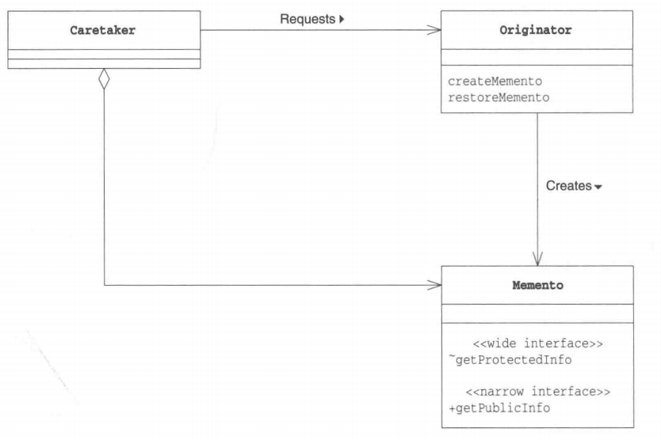

# 备忘录模式

## 概述

&emsp;备忘录模式（Memento Pattern）可以保存一个对象的某个状态，以便在适当的时候恢复对象。备忘录最常用的实现就是游戏的存档、读档功能，使得我们可以随时恢复到之前的状态。


## 类型

&emsp;备忘录模式属于行为型模式。

## 介绍

- **目的**：在不破坏封装性的前提下，捕获一个对象的内部状态，并在该对象之外保存这个状态。
- **主要解决**：在不破坏封装性的前提下，捕获一个对象的内部状态，并在该对象之外保存这个状态，这样可以在以后将对象恢复到原来保存的状态。
- **使用场景**：为了允许用户取消不确定或错误的操作，并且能够恢复到他原先的状态时，就可以通过备忘录模式，在不破坏封装性的前提下，记录一个对象的内部状态。

## 示例代码

&emsp;这里我们以游戏为例，英雄进行Boss之战前会进行存档，英雄死亡后，会通过读取存档重新恢复状态。

### Memento类

&emsp;Memento类可以简单理解为存档类，它记录了英雄的生命值和属性作为一个存档。

```java
package memento;

public class Memento {
    private int life;
    private int magic;
    public Memento(Hero hero){
        life = hero.getLife();
        magic = hero.getMagic();
    }

    public int getLife() {
        return life;
    }

    public int getMagic() {
        return magic;
    }
}
```

### Hero类

&emsp;Hero类是英雄的具体类，fightWithBoss方法用于演示打Boss

```java
package memento;

/**
 * ClassName: Hero <br/>
 *
 * @author Ning <br/>
 * @date 2023/10/21 0021
 * @since JDK 11
 */
public class Hero {
    // 生命值
    private int life;
    // 魔法值
    private int magic;

    public Hero(){
        this.life = 100;
        this.magic = 100;
    }

    public int getLife() {
        return life;
    }

    public void setLife(int life) {
        this.life = life;
    }

    public int getMagic() {
        return magic;
    }

    public void setMagic(int magic) {
        this.magic = magic;
    }

    public void fightWithBoss(){
        life -= 100;
        magic -= 100;
        if(life <= 0){
            System.out.println("英雄死亡！");
        }
        System.out.println(this);
    }

    public Memento saveState(){
        System.out.println(this);
        return new Memento(this);
    }

    public void restoreState(Memento memento){
        this.life = memento.getLife();
        this.magic = memento.getMagic();
        System.out.println(this);
    }

    public String toString(){
        return "英雄生命值：" + life + ",魔法值：" + magic + ".";
    }
}
```

&emsp;测试代码及运行结果如下：

```java
package memento;

import org.junit.Test;

public class MementoTest {
    @Test
    public void mementoTest(){
        // 创建一个英雄
        Hero hero = new Hero();
        // 创建一个存档
        Memento memento = hero.saveState();
        // 打Boss
        hero.fightWithBoss();
        // 打Boss失败了，读取存档进行复活
        hero.restoreState(memento);
    }
}
```

```text
英雄生命值：100,魔法值：100.
英雄死亡！
英雄生命值：0,魔法值：0.
英雄生命值：100,魔法值：100.
```

## 备忘录中的角色

- **Originator**:生成者，该角色会在保存自己的最新状态时生成Memento角色，当把以前保存的Memento角色传递给当前角色时，它会将自己恢复至生成该Memento角色时的状态。在上述示例中，`Hero`扮演着这一角色。
- **Memento**:备忘录或存档，该角色会将Originator的内部信息整合起来。该角色中虽然保存了Originator的信息，但它不会向外部公开这些信息。在上述示例中,`Memento`扮演着这一角色。
- **Caretaker**：负责人，该角色想要保存当前的Originator角色的状态时，会通知Originator角色，Originator角色收到通知后会生成一个Memento对象返回给Caretaker角色，并保存下来供后续恢复场景使用。在上述示例中测试代码扮演着这一角色。



## 其它

&emsp;为了符合迪米特原则，还要增加一个管理备忘录的类;为了节约内存，可使用原型模式+备忘录模式;备忘录模式为系统提供了可回滚的操作。
