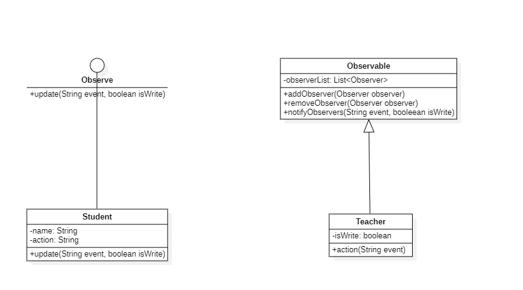

# 观察者模式

## 概述

&emsp;观察者(Observer)模式定义了对象间的一种一对多的依赖关系，当一个对象的状态发生改变时，所有依赖于它的对象都会得到通知并碑额自动更新。

## 类型

&emsp;观察者模式属于行为型模式。

## 介绍

- **目的**：定义对象间的一种一对多的依赖关系，当一个对象的状态发生改变时，所有依赖于它的对象都得到通知并被自动更新。
- **主要解决**：一个对象状态改变，给其它对象通知的问题，而且要考虑到易用和低耦合，保证高度的协作。
- **使用应用**：当对象存在一对多关系时，则使用观察者模式。比如，当一个对象被修改时，则会自动通知依赖它的对象。
- **解决方案**：使用面向对象技术，可以将这种依赖关系弱化。

## 示例代码

&emsp;这里以上课时的老师和学生作为情景。在该情景中，老师是被观察者对象，学生是观察者，当老师使用粉笔在黑板上写字时，学生就会在下面搞小动作；当老师写完板书回头时，学生就会正襟危坐认真听讲。

### Observer接口

&emsp;观察者接口，用于接收来自被观察者的状态变化通知。

```java
package observer;

public interface Observer {
    void update(String event,boolean isWrite);
}
```

### Observable对象

&emsp;Observable对象用于表示观察对象，在该对象中定义了注册观察者和删除观察者的方法，除此之外还有一个获取当前状态的方法。

```java
package observer;

import java.util.ArrayList;
import java.util.List;

public class Observable {
    private List<Observer> observerList = new ArrayList<>();
    public void addObserver(Observer observer){
        observerList.add(observer);
    }
    public void removeObserver(Observer observer){
        observerList.remove(observer);
    }
    public void notifyObservers(String event,boolean isWrite){
        observerList.forEach( e -> e.update(event,isWrite));
    }
}
```
### Teacher类

&emsp;Teacher是被观察的对象，是Observable的子类。

```java
package observer;

public class Teacher extends Observable{
    private boolean isWrite;
    public void action(String event,boolean isWrite){
        System.out.println("老师正在" + event);
        // 获取观察者的状态
        notifyObservers(event,isWrite);
    }
}
```

### Student类

&emsp;Student是观察者，观察着老师的一举一动，因此需要实现Observer接口。

```java
package observer;

public class Student implements Observer{
    // 学生姓名
    private String name;
    // 具体的小动作
    private String action;
    public Student(String name,String action){
        this.name = name;
        this.action = action;
    }

    @Override
    public void update(String event, boolean isWrite) {
        System.out.println("观察者：" + name + "------------");
        System.out.println(name+"知道老师正在" + event);
        if(isWrite){
            System.out.println(name + "开始" + action);
        }else{
            System.out.println(name + "开始认真听课！");
        }
    }
}
```

&emsp;编写一下测试类跑一跑：

```java
package ovserver;

import observer.Student;
import observer.Teacher;
import org.junit.Test;

public class ObserverTest {
    @Test
    public void observerTest(){
        Teacher teacher = new Teacher();
        Student xiaoMing = new Student("小明", "吃东西");
        Student xiaoGang = new Student("小刚", "看小说");
        Student xiaoNing = new Student("小宁", "牵女生手手");
        teacher.addObserver(xiaoMing);
        teacher.addObserver(xiaoGang);
        teacher.addObserver(xiaoNing);

        teacher.action("板书",true);

        teacher.action("讲解",false);
    }
}
```

```text
老师正在板书
观察者：小明------------
小明知道老师正在板书
小明开始吃东西
观察者：小刚------------
小刚知道老师正在板书
小刚开始看小说
观察者：小宁------------
小宁知道老师正在板书
小宁开始牵女生手手
老师正在讲解
观察者：小明------------
小明知道老师正在讲解
小明开始认真听课！
观察者：小刚------------
小刚知道老师正在讲解
小刚开始认真听课！
观察者：小宁------------
小宁知道老师正在讲解
小宁开始认真听课！
```



## 观察者模式中的角色

- **Subject**:被观察者对象，定义了注册观察者和删除观察者的方法，除此之外，还声明了获取当前状态的方法，在上述示例中，`Observable`扮演着这一角色。
- **ConcreteSubject**：具体的被观察对象，当该对象的自身状态发生变化后，它就会通知所有已经注册的Observer角色。在上述示例中，`Teacher`扮演着这一角色。
- **Observe**：观察者，该角色负责接收来自Subject角色的状态变化通知，在该角色中有一个update方法可以体现这一点。在上述示例中，`Observer`接口扮演着这一角色。
- **ConcreteObserver**:具体的观察者，该对象的update方法被调用后，会去获取要观察的对象的最新状态。在上述示例中，`Student`扮演着这一角色。


## 其它

&emsp;实际上，Java 已经为我们提供了的 Observable 类和 Observer 类，我们在用到观察者模式时，无需自己创建这两个基类，我们可以看一下 Java 中提供的源码：

> 下面这两个类在`java.utils.*`下。

### Observer接口

```java
public interface Observer {
    void update(Observable o, Object arg);
}
```

### Observable类

```java
public class Observable {
    private boolean changed = false;
    private Vector<Observer> obs;

    public Observable() {
        obs = new Vector<>();
    }

    public synchronized void addObserver(java.util.Observer o) {
        if (o == null)
            throw new NullPointerException();
        if (!obs.contains(o)) {
            obs.addElement(o);
        }
    }

    public synchronized void deleteObserver(java.util.Observer o) {
        obs.removeElement(o);
    }

    public void notifyObservers() {
        notifyObservers(null);
    }

    public void notifyObservers(Object arg) {
        Object[] arrLocal;
        synchronized (this) {
            if (!hasChanged())
                return;
            arrLocal = obs.toArray();
            clearChanged();
        }
        for (int i = arrLocal.length - 1; i >= 0; i--)
            ((Observer) arrLocal[i]).update(this, arg);
    }

    public synchronized void deleteObservers() {
        obs.removeAllElements();
    }

    protected synchronized void setChanged() {
        changed = true;
    }

    protected synchronized void clearChanged() {
        changed = false;
    }

    public synchronized boolean hasChanged() {
        return changed;
    }

    public synchronized int countObservers() {
        return obs.size();
    }
}
```

&emsp;从Java 9开始，这两个以被弃用，但其中的源码可以供我们参考，弃用原因参考这篇文章：[https://segmentfault.com/q/1010000042897833](https://segmentfault.com/q/1010000042897833)：

