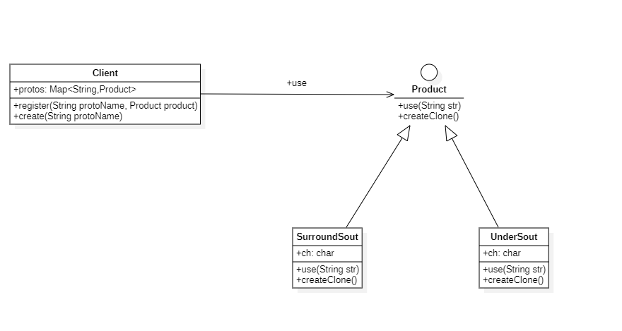
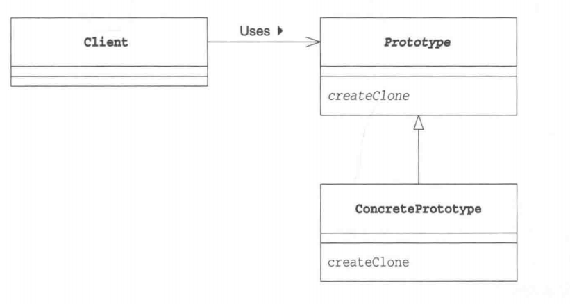

# 原型模式

## 概述

&emsp;原型模式（Prototype Pattern）是用于创建重复的对象，同时又能保证性能。它提供了一种创建对象的最佳方式之一。

## 类型

&emsp;原型模式属于创建型模式。

## 介绍

- **目的**：用原型实例指定创建对象的种类，并且通过拷贝这些原型创建新的对象。
- **主要解决**：在运行期建立和删除原型。
- **使用场景**：1、当一个系统应该独立于它的产品创建，构成和表示时。 2、当要实例化的类是在运行时刻指定时，例如，通过动态装载。 3、为了避免创建一个与产品类层次平行的工厂类层次时。 4、当一个类的实例只能有几个不同状态组合中的一种时。建立相应数目的原型并克隆它们可能比每次用合适的状态手工实例化该类更方便一些。
- **解决方案**：利用已有的原型对象，快速地生成和原型对象一样的实例。
- **实现策略**：在Java中，通过实现Cloneable接口，重写clone方法完成克隆操作。

## 示例代码

&emsp;这里我们以输出不同的字符串样式为例，进行介绍。其中涉及到两个类：`SurroundSout`和`UnderSout`,分别表示将字符串用某一字符包裹起来进行输出，和用某一字符串放在字符串下面进行输出，样例代码如下：

```text
// SurroundSout
************
*HelloWorld*
************

// UnderSout
HelloWorld
**********
```

### Product类

&emsp;首先我们需要定义原型的接口，该接口用于定义用于复制现有实例来生成新实例的方法。在Java中，我们可以让该接口继承Cloneable接口从而让其子类获得clone方法。

```java
package prototype;

public interface Product extends Cloneable{
    // 其子类都具备use方法，该方法可以将str按照某种样式进行输出，至于具体的输出形式和实现方法由子类决定
    void use(String str);
    // 其子类需要提供一个复制方法，将自身复制一份并返回，至于复制对象及其过程由子类决定
    Product createClone();
}
```

### Client类

&emsp;然后我们还需要定义一个Client类，该类需要向我们提供一些方法用于创建新对象。

```java
package prototype;

import java.util.Map;
import java.util.concurrent.ConcurrentHashMap;

public class Client {
    // 用于存放各种原型对象，每种原型对象都对应着一个key,在这里我们用一个字符串来表示每个原型对象的唯一key
    Map<String,Product> protos = new ConcurrentHashMap<>();
    // 该方法用于将原型对象的信息存储在哈希表中
    public void register(String name,Product product){
        protos.put(name,product);
    }
    // 该方法用于创建新的对象，即通过每个原型对象的key获取原型对象的拷贝份。
    public Product create(String protoName){
        Product product = protos.get(protoName);
        return product.createClone();
    }
}
```

&emsp;接下来我们就只需要定义SurroundSout类和UnderSout类即可，并让这些类去实现Product接口

### SurroundSout

```java
package prototype;

public class SurroundSout implements Product{

    private char ch;

    public SurroundSout(char ch){
        this.ch = ch;
    }

    @Override
    public void use(String str) {
        int len = str.length();
        for(int i=0;i<len+2;i++){
            System.out.print(this.ch);
        }
        System.out.println();
        for (int i=0;i<len+2;i++){
            if(i == 0 || i == len+1){
                System.out.print(this.ch);
            }else{
                System.out.print(str.charAt(i-1));
            }
        }
        System.out.println();
        for(int i=0;i<len+2;i++){
            System.out.print(this.ch);
        }
        System.out.println();
    }

    @Override
    public Product createClone() {
        Product product = null;
        try {
            product = (Product)clone();
        }catch (CloneNotSupportedException e){
            e.printStackTrace();
        }
        return product;
    }
}
```

### UnderSout类

```java
package prototype;

public class UnderSout implements Product{
    private char ch;
    public UnderSout(char ch){
        this.ch = ch;
    }
    @Override
    public void use(String str) {
        int len = str.length();
        System.out.println(str);
        for(int i=0;i<len;i++){
            System.out.print(this.ch);
        }
        System.out.println();
    }

    @Override
    public Product createClone() {
        Product product = null;
        try {
            product = (Product) clone();
        }catch (CloneNotSupportedException e){
            e.printStackTrace();
        }
        return product;
    }
}
```

&emsp;完成这些后，我们就可以写一段测试代码跑一跑了

```java
package prototype;

import org.junit.Test;

public class PrototypeTest {

    @Test
    public void prototypeTest(){
        Client client = new Client();
        // 我们注册一个包裹着*的输出原型便于后面使用，该原型的key为"surround by *"
        client.register("surround by *",new SurroundSout('*'));
        // 我们注册一个下划-的输出原型便于后面使用
        client.register("under by -",new UnderSout('-'));
        // 当我们想创建一个包裹着*的输出原型时，就可以直接通过对应的key进行创建
        Product product = client.create("surround by *");
        Product product1 = client.create("under by -");
        product.use("Hello World!");
        product1.use("Hello Java!");
    }
}
```

&emsp;上述代码的UML类图如下：



## 原型模式中的角色

- **Prototype（原型）**：Prototype角色负责定义用于复制现有实例来生成新实例的方法。在上述示例程序中，`Product`接口扮演着这一角色。
- **ConcretePrototype（具体的原型）**：ConcretePrototype角色负责实现复制现有实例并生成新实例的方法。在上述示例程序中，`SurroundSout`和`UnderSout`均扮演着这一角色.
- **Client（使用者）**：Client角色负责使用复制实例的方法生成新的实例。在上述示例程序中，`Client`扮演着这一角色。



## 其它

&emsp;与通过对一个类进行实例化来构造新对象不同的是，原型模式是通过拷贝一个现有对象生成新对象的。浅拷贝实现 Cloneable，重写，深拷贝是通过实现 Serializable 读取二进制流。

&emsp;原型模式很少单独出现，一般是和工厂方法模式一起出现，通过 clone 的方法创建一个对象，然后由工厂方法提供给调用者。原型模式已经与 Java 融为浑然一体，大家可以随手拿来使用。