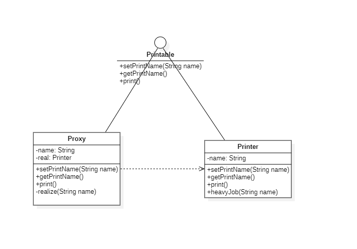
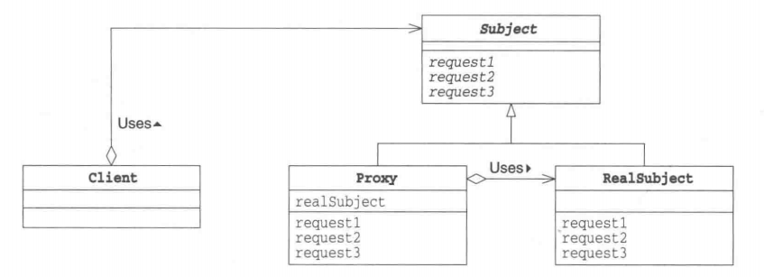

# 代理模式

## 概述

&emsp;代理(Proxy)模式中，一个类代表另一个类的功能。我们创建具有现有对象的对象，以便向外界提供功能接口。

## 类型

&emsp;代理模式属于结构型模式。

## 介绍

- **目的**：为其他对象提供了一种代理以控制对这个对象的访问。
- **主要解决**：代理对象解决的是直接访问对象时带来的问题。直接访问会给使用者或者系统结构带来很多麻烦，因此我们可以在访问此对象时加上一个对此对象的访问层。
- **使用场景**：当我们在访问一个类时需要做一些控制时，就可以使用代理模式。

## 示例代码

&emsp;这里以打印姓名为例。

### Printable接口

&emsp;Printable接口定义了代理者与实际对象的统一接口，因此在用户使用代理进行实际对象操作时，就不需要区分彼此了。

```java
package proxy;

public interface Printable {
    void setPrintName(String name);
    String getPrintName();
    void print(String name);
}
```

### Printer类

&emsp;Printer是实际的工作者，客户端通过代理调用代理对象执行相关操作时，代理对象就会通过执行实际工作的对象方法来完成。

```java
package proxy;

public class Printer implements Printable{

    private String name;

    public Printer(String name){
        heavyJob("生成实例对象" + name + "中.");
        this.name = name;
    }

    @Override
    public void setPrintName(String name) {
        this.name = name;
    }

    @Override
    public String getPrintName() {
        return name;
    }

    @Override
    public void print(String name) {
        System.out.println("===" + name + "===");
        System.out.println(name);
    }

    private void heavyJob(String msg){
        System.out.println(msg);
        for (int i = 0; i < 5; i++) {
            try{
                Thread.sleep(1000);
                System.out.println(".");
            }catch (InterruptedException e){
                e.printStackTrace();
            }
        }
        System.out.println("结束");
    }
}
```

### Proxy类

&emsp;Proxy扮演着代理人的角色，它用于处理来自客户端的请求，实际工作会通过Printer对象来执行。

```java
package proxy;

public class Proxy implements Printable{

    private String name;
    Printer real;

    public Proxy(){}

    @Override
    public synchronized void setPrintName(String name) {
        this.name = name;
    }

    @Override
    public String getPrintName() {
        return name;
    }

    @Override
    public void print(String name) {
        realize(name);
        real.print(name);
    }
    private synchronized void realize(String name){
        if (real == null){
            real = new Printer(name);
        }
    }
}
```

&emsp;测试代码及运行结果如下：

```java
package proxy;

import org.junit.Test;

public class ProxyTest {
    @Test
    public void proxyTest(){
        Proxy proxy = new Proxy();
        proxy.print("Alice");
        proxy.print("Bob");
    }
}
```

```text
生成实例对象Alice中. 
.
.
.
.
.
结束
===Alice===
Alice
===Bob===
Bob
```

&emsp;类图



## 代理模式中的角色

- **Subject**:Subject角色定义了使Proxy角色和RealSubject角色之间具有一致性的接口，正因如此，Client角色就不需要在意它所使用的究竟是Proxy角色还是RealSubject角色。在上述示例中，`Printable`接口。
- **Proxy**:Proxy角色会处理来自Client角色的请求，只有当自己不能处理时，它才会将工作交给RealSubject角色。Proxy角色只有在必要时才会生成RealSubject角色。在上述示例中，`Proxy`扮演着这一角色。
- **RealSubject**:RealSubject角色是具体的执行者。在上述示例中，`Printer`就扮演着这一角色。



## 其它

&emsp;代理模式与适配器的区别：**适配器模式主要改变所考虑对象的接口，而代理模式不能改变所代理类的接口**。 

&emsp;代理模式与装饰器的区别：**装饰器模式是为了增强功能，而代理模式是为了加以控制**。