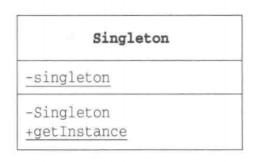

# 单例模式

## 概况

&emsp;单例模式（singleton Pattern）是 Java 中最简单的设计模式之一。它提供了一种创建对象的最佳方式。这种模式涉及到一个单一的类，该类负责创建自己的对象，同时确保只有单个对象被创建。这个类提供了一种访问其唯一的对象的方式，可以直接访问，不需要实例化该类的对象。

## 类型

&emsp;单例模式属于创建型模式。

## 介绍

- **目的**：保证一个类仅有一个实例，并提供一个访问它的全局访问点。
- **主要解决**：一个全局使用的类频繁地创建与销毁。
- **使用场景**：一个类只需要一个实例，需要节省系统资源的时候。
- **解决方案**：判断系统是否已经有这个单例，如果有，则返回，如果没有，则创建。

&emsp;单例模式分为：`懒汉式`和`饿汉式`。

## 示例代码

&emsp;这里以一个Me类作为单例。

### 懒汉式

&emsp;懒汉式的单例特点：**单例在声明时为空，需要时才会被初始化**。

#### 不考虑线程安全问题

```java
package singleton;

public class MeByLazy {
    private static MeByLazy instance;
    // 将构造器设置为private，这样就可以避免实例被再次创建了
    private MeByLazy(){}
    public static MeByLazy getInstance(){
        if(instance == null){
            instance = new MeByLazy();
        }
        return instance;
    }
    // 单例的其它方法
    public void run(){
        System.out.println("I can run.");
    }

    public void eat(){
        System.out.println("I can eat.");
    }
}
```

&emsp;因为懒汉式是在需要时，单例才会被创建，因此我们需要考虑线程安全问题。上面的代码不是线程安全的，**如果有多个线程在同一时间调用上述的getInstance方法，那么instance变量可能会被实例化多次，因此我们需要在判空过程中给它加一个锁**。

#### 考虑线程安全问题

```java
package singleton;

public class MeByLazySyn {
    private static MeByLazySyn instance;
    private MeByLazySyn(){}
    public static MeByLazySyn getInstance(){
        synchronized (MeByLazySyn.class){
            if(instance == null){
                instance = new MeByLazySyn();
            }
        }
        return instance;
    }

    public void run(){
        System.out.println("I can run.");
    }

    public void eat(){
        System.out.println("I can eat.");
    }
}
```

#### 双检锁方式

&emsp;上述的代码解决了线程安全问题，但**这样的写法仍然有问题，当多个线程调用 getInstance 时，每次都需要执行 synchronized 同步化方法，这样会严重影响程序的执行效率**。因此我们还需要在加锁的外面再进行判空的判断。

```java
package singleton;

public class MeByLazySynDouble {
    private static MeByLazySynDouble instance;
    private MeByLazySynDouble(){}
    public static MeByLazySynDouble getInstance(){
        if(instance == null){
            synchronized (MeByLazySynDouble.class){
                if(instance == null){
                    instance = new MeByLazySynDouble();
                }
            }
        }
        return instance;
    }
    public void run(){
        System.out.println("I can run.");
    }

    public void eat(){
        System.out.println("I can eat.");
    }
}
```

&emsp;除了上述几种方式保证懒汉式单例的线程安全问题外，还有一种常见的**静态内部类的方式保证懒汉式单例的线程安全问题**。

```java
package singleton;

public class MeByInnerClass {
    // 静态内部类
    private static class MeByInnerClassHolder {
        public static MeByInnerClass instance = new MeByInnerClass();
    }
    private MeByInnerClass(){}

    public static MeByInnerClass getInstance(){
        return MeByInnerClassHolder.instance;
    }

    public void run(){
        System.out.println("I can run.");
    }

    public void eat(){
        System.out.println("I can eat.");
    }
}
```

### 饿汉式

&emsp;饿汉式单例的特点就是：**单例在声明时就创建出来了**，这种方式是线程安全的，也是一般项目开发中推荐使用的单例实现方式。

```java
package singleton;

public class Me {
    private static MeByHungry instance = new MeByHungry();
    private Me() {
    }
    public static MeByHungry getInstance() {
        return instance;
    }
    public void run() {
        System.out.println("I can run.");
    }

    public void eat() {
        System.out.println("I can eat.");
    }
}
```

&emsp;上述单例实现方式的测试代码如下：

```java
package singleton;

import org.junit.Test;

public class SingletonTest {

    @Test
    public void hungryTest(){
        MeByHungry instance = MeByHungry.getInstance();
        instance.eat();
        instance.run();
    }

    @Test
    public void lazyTest(){
        MeByLazy instance = MeByLazy.getInstance();
        instance.eat();
        instance.run();
    }

    @Test
    public void lazySynTest(){
        MeByLazySyn instance = MeByLazySyn.getInstance();
        instance.eat();
        instance.run();
    }

    @Test
    public void lazySynDoubleTest(){
        MeByLazySynDouble instance = MeByLazySynDouble.getInstance();
        instance.eat();
        instance.run();
    }

    @Test
    public void lazyInnerClassTest(){
        MeByInnerClass instance = MeByInnerClass.getInstance();
        instance.eat();
        instance.run();
    }
}
```

## 单例模式中的角色

- **Singleton**:在单例模式中，就只有Singleton这一角色。Singleton角色中有一个返回唯一实例的static方法。



## 其它

&emsp;在懒汉式单例实现中，getInstance() 方法中需要使用同步锁 synchronized (Singleton.class) 防止多线程同时进入造成 instance 被多次实例化。


