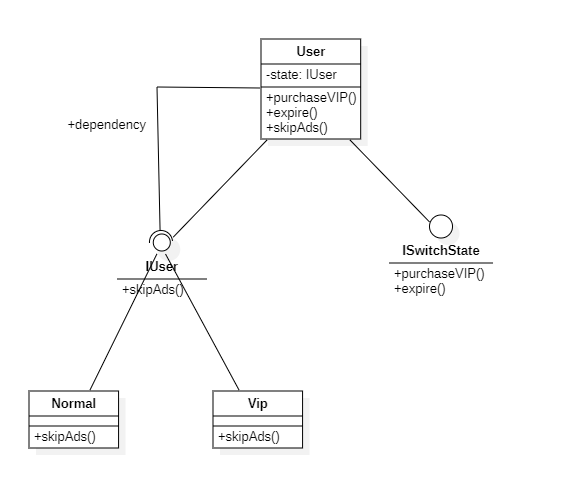
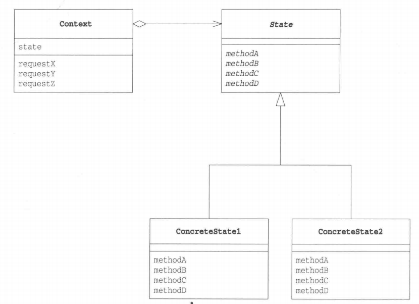

# 状态模式

## 概述

&emsp;状态（State ）模式：当一个对象的内在状态改变时允许改变其行为，这个对象看起来像是改变了其类。

## 类型

&emsp;状态模式属于行为型模式。

## 介绍

- **目的**：允许对象在内部状态发生改变时改变它的行为，对象看起来好像修改了它的类。
- **主要解决**：对象的行为依赖于它的状态（属性），并且可以根据它的状态改变而改变它的相关行为。
- **使用场景**：当代码中包含了大量与对象状态有关的条件语句时，就可以考虑使用状态模式。

## 示例代码

&emsp;这里以会员系统为了，当用户进行充值，那么用户状态从普通用户变为VIP用户，当VIP过期时，用户从VIP变为普通用户。

### IUser接口

&emsp;IUser接口定义了一些用户的操作，有些操作是只有会员才能使用的。为了简单起见，这里只定义了一个跳过广告的操作。

```java
package state;

public interface IUser {
    void skipAds();
}
```

### ISwitchSate接口

&emsp;ISwitchState接口定义了切换状态的方法。

```java
package state;

public interface ISwitchState {
    void purchaseVIP();
    void expire();
}
```

### User类

```java
package state;

public class Normal implements IUser{
    @Override
    public void skipAds() {
        // 普通用户在执行跳过广告时执行的操作
        System.out.println("普通用户不支持跳过广告！");
    }
}
```


### Normal类

&emsp;Normal类是User的一个状态类，表示普通用户。普通用户想跳过广告时，是不允许的。

```java
package state;

public class Normal implements IUser{
    @Override
    public void skipAds() {
        // 普通用户在执行跳过广告时执行的操作
        System.out.println("普通用户不支持跳过广告！");
    }
}
```

### Vip类

&emsp;Vip类也是User的一个状态类，表示VIP用户。对于VIP用户，是允许跳过广告的。

```java
package state;

public class Vip implements IUser{
    @Override
    public void skipAds() {
        System.out.println("尊敬的VIP用户，我们已为您自动跳过了广告！");
    }
}
```

### User类

&emsp;User类通过状态类执行相关的用户操作即可，就不需要设计分支语句了。

```java
package state;

public class User implements IUser,ISwitchState{
    // 默认用户为普通用户
    private IUser state = new Normal();
    // 用户选择升级为VIP时，就创建一个Vip状态对象作为state
    @Override
    public void purchaseVIP() {
        state = new Vip();
    }
    // 用户的VIP过期时，就创建一个Normal状态对象作为state
    @Override
    public void expire() {
        state = new Normal();
    }

    @Override
    public void skipAds() {
        // 直接执行当前状态的用户操作
        state.skipAds();
    }
}
```

&emsp;测试代码及运行结果

```java
package state;

import org.junit.Test;

public class StateTest {
    @Test
    public void stateTest(){
        // 创建一个用户
        User user = new User();
        // 该用户执行跳过广告的操作
        user.skipAds();
        // 该用户选择升级为VIP
        user.purchaseVIP();
        // 该用户再次执行跳过广告的操作
        user.skipAds();
        // 该用户的VIP过期了
        user.expire();
        // 该用户还想执行跳过广告的操作
        user.skipAds();
    }
}
```

```text
普通用户不支持跳过广告！
尊敬的VIP用户，我们已为您自动跳过了广告！
普通用户不支持跳过广告！
```



## 状态模式中的角色

- **State**:State表示状态，定义了根据不同状态进行不同处理的接口。该接口是依赖于状态所执行的操作的集合。在上述示例中，`IUser`接口扮演着这一角色。
- **ConcreteState**：ConcreteState表示具体状态，依据不同状态，它实现了State接口。在上述示例中，`Normal`和`Vip`扮演着这一角色。
- **Context**: Context角色持有表示当前状态的ConcreteState角色，除此之外，它还定义了供外部调用者使用State模式的接口。在上述示例中，`User`和`ISwitchState`共同扮演着这一角色。



## 其它

&emsp;在行为受状态约束的时候使用状态模式，而且状态不超过 5 个。若状态超过5个，则需要考虑对状态模式进行变体或使用其它的组合型设计模式。