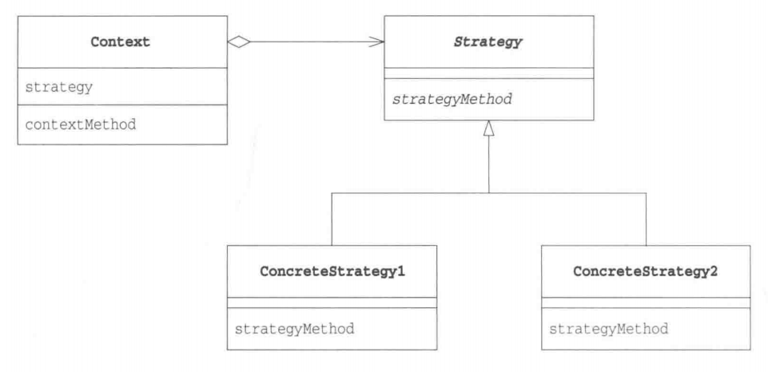

# 策略模式

## 概述

&emsp;策略(Strategy)模式是一个类的行为或算法可以在运行时更改。策略模式定义了一系列算法或策略，并将这些算法封装在独立的类中，使得它们可以互相替换。通过使用策略模式，可以在运行时根据需要选择不同的算法，而不需要修改客户端代码。

## 类型

&emsp;策略模式属于行为型模式。

## 介绍

- **目的**：定义一系列算法，将它们一个个封装起来，并且使它们可以相互替换。
- **主要解决**：在有多种算法的情况下，使用if ... else 所带来的的复杂和难以维护。
- **使用场景**：一个系统有许多许多类，而区分它们的只是它们直接的行为时。
- **解决方案**：将这些行为（算法）封装为一个个类，任意地替换即可。
- **注意事项**：如果一个系统的策略多于四个，就需要考虑使用混合模式，解决策略类膨胀的问题。

## 示例代码

&emsp;这里我们以数组排序为例，使用策略模式对一个数组进行排序。

### 分析

&emsp;实现策略模式的关键在于将不同行为的同一目的封装成一个个类，并用一个接口统一这些类。对于排序算法，我们可以定义一个接口`ISort`,该接口定义了`sort`方法，然后将冒泡排序、快速排序、选择排序单独封装成一个个类，并让这些类实现`ISort`接口。

### ISort接口

```java
package strategy;

public interface ISort {
    void sort(int[] arr);
}
```

### BubbleSort类

```java
package strategy;

public class BubbleSort implements ISort{
    @Override
    public void sort(int[] arr) {
        System.out.println("This is bubble sort:");
        boolean flag = false;
        for (int i = 0; i < arr.length-1; i++) {
            flag = true;
            for (int j = 0; j < arr.length-1-i; j++) {
                if(arr[j] > arr[j+1]){
                    int t = arr[j];
                    arr[j] = arr[j+1];
                    arr[j+1] = t;
                    flag = false;
                }
            }
            if(flag){
                break;
            }
        }
    }
}
```

### InsertSort类

```java
package strategy;

public class InsertSort implements ISort{
    @Override
    public void sort(int[] arr) {
        System.out.println("This is insert sort:");
        int low = 0;
        int high = 0;
        int m = 0;

        for (int i = 1; i < arr.length; i++) {
            low = 0;
            high = i -1;
            while (low <= high){
                m = (low + high) / 2;
                if(arr[m] > arr[i]){
                    high = m - 1;
                }else {
                    low = m + 1;
                }
            }
            int temp = arr[i];
            for (int j = i; j > high + 1; j--) {
                arr[j] = arr[j-1];
            }
            arr[high + 1] = temp;
        }
    }
}
```

### QuickSort类

```java
package strategy;

public class QuickSort implements ISort{

    @Override
    public void sort(int[] arr) {
        System.out.println("This is quick sort:");
        quickSort(arr,0,arr.length-1);
    }

    private int partition(int arr[],int start,int end){
        int pivot = arr[start];
        int left = start + 1;
        int right = end;
        while (left < right){
            while (left < right && arr[left] < pivot) left++;
            while (left < right && arr[right] > pivot) right--;
            if (left < right){
                int temp = arr[left];
                arr[left] = arr[right];
                arr[right] = temp;
                left++;
                right--;
            }
        }
        if(left == right && arr[left] > pivot) right--;
        int temp = arr[start];
        arr[start] = arr[right];
        arr[right] = temp;
        return right;
    }

    private void quickSort(int arr[],int satrt,int end){
        if(satrt < end){
            int pivotIndex = partition(arr,satrt,end);
            quickSort(arr,satrt,pivotIndex-1);
            quickSort(arr,pivotIndex+1,end);
        }
    }
}
```

### Sort类

```java
package strategy;

/**
 * ClassName: Sort <br/>
 *
 * @author Ning <br/>
 * @date 2023/10/15 0015
 * @since JDK 11
 */
public class Sort implements ISort{

    private ISort iSort;

    public Sort(ISort iSort){
        this.iSort = iSort;
    }

    @Override
    public void sort(int[] arr) {
        iSort.sort(arr);
    }
    
    // 通过调用该方法就可以设置不同的算法
    public void setSort(ISort iSort){
        this.iSort = iSort;
    }
}
```

&emsp;测试代码如下：

```java
package strategy;

import org.junit.Test;

public class StrategyTest {
    @Test
    public void strategyTest(){
        int[] arr = {5,4,3,6,7,4,2,1,0,8,9,10};
        Sort sort = new Sort(new QuickSort());
        sort.sort(arr);
        display(arr);
        arr = new int[]{4, 5, 2, 3, 4, 5, 6, 7, 1, 2, 0, 10};
        sort.setSort(new InsertSort());
        sort.sort(arr);
        display(arr);

        arr = new int[]{7,6,5,8,9,32,4,2,3,0};
        sort.setSort(new BubbleSort());
        sort.sort(arr);
        display(arr);
    }

    public void display(int arr[]){
        for (int e :
                arr) {
            System.out.print(e + " ");
        }
        System.out.println();
        System.out.println();
    }
}
```

```text
This is quick sort:
0 1 2 3 4 4 5 6 7 8 9 10 

This is insert sort:
0 1 2 2 3 4 4 5 5 6 7 10 

This is bubble sort:
0 2 3 4 5 6 7 8 9 32 

```

## 策略模式中的角色

- **Strategy**: 该角色负责决定实现策略所必须的接口。在本示例中，`ISort`扮演着这一角色。
- **ConcreteStrategy**：该角色负责实现Strategy角色定义的接口，即负责实现具体的策略。在本示例中，`BubbleSort`、`InsertSort`和`QuickSort`均扮演着这一角色。
- **Context**:该角色负责使用Strategy角色。Context角色需要有Strategy的实例，或者说是ConcreteStrategy的实例，因为需要通过该实例调用相应的决策。在本示例中，`Sort`扮演着这一角色。



## 其它

&emsp;策略模式用一个成语就可以概括 —— 殊途同归。当我们做同一件事有多种方法时，就可以将每种方法封装起来，在不同的场景选择不同的策略，调用不同的方法。