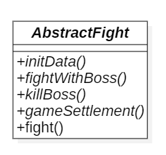
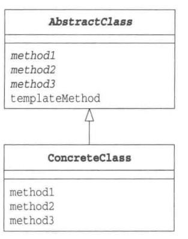

# 模板方法模式

## 概述

&emsp;模板方法(Template Method)模式是带有模板功能的模式，组成模板的方法被定义在父类中。由于这些方法是抽象方法，所以只查看父类的代码是无法知道这些方法最终会进行何种具体处理的，唯一能知道的就是父类是如何调用这些方法的。

## 类型

&emsp;模板方法属于行为型模式。

## 介绍

- **目的**：定义一个操作中的算法骨架，而将这些步骤延迟到子类中。模板方法使得子类可以不改变一个算法的结构即可重定义该算法的某些特定步骤。
- **主要解决**：一些方法通用，却在每一个子类都重写了这一方法。
- **使用场景**：有多个子类共有的方法，且逻辑相同；重要的、复杂的方法，可以考虑作为模板方法。
- **解决方案**：将这些通用算法抽象出来。
- **注意事项**：为了防止恶意操作，一般模板方法上都会加上`final`关键字。

## 示例代码

&emsp;这里我们以打Boss为例，假设每个角色打Boss的流程不变，这意味着打Boss的流程算法和逻辑对每个角色都是一致的。每一个角色打Boss都会依次执行`initData()`、`fightWithBoss()`、`KillBoss()`和`gameSettlement()`方法。

### 需求分析

&emsp;可以发现每个角色在打Boss的时候，其算法逻辑均一致，因此我们可以使用模板方法模式将这些角色打Boss时涉及的算法抽象出来组成一个抽象类`AbstractFight`,该类需均定义`initData()`、`fightWithBoss()`、`KillBoss()`和`gameSettlement()`方法，除此之外，就是将这些算法的执行过程定义为一个方法`fight()`，作为模板。AbstractFight类图如下：



&emsp;然后对于每一个角色，都去继承这一抽象类并实现对应的`initData()`、`fightWithBoss()`、`KillBoss()`和`gameSettlement()`方法即可。下述我们将定义两个角色：`IronMan`和`SpiderMan`

#### AbstractFight类

```java
package template;

public abstract class AbstractFight {
    public abstract void initData();
    public abstract void fightWithBoss();
    public abstract void killBoss();
    public abstract void gameSettlement();
    // 这里定义的就是打Boss的整个流程，也就是算法逻辑
    public void fight(){
        initData();
        for (int i = 0; i < 5; i++) {
            fightWithBoss();
        }
        killBoss();
        gameSettlement();
    }
}
```

#### IronMan类

```java
package template;

public class IronMan extends AbstractFight{

    private String name;
    public IronMan(String name){
        this.name = name;
    }
    @Override
    public void initData() {
        System.out.println(name+"'s data loading finished!");
    }

    @Override
    public void fightWithBoss() {
        System.out.println(name+" is fighting using his iron fist!");
    }

    @Override
    public void killBoss() {
        System.out.println(name+" killed the Boss!");
    }

    @Override
    public void gameSettlement() {
        System.out.println(name+ " won!");
    }
}
```

#### SpiderMan类

```java
package template;

/**
 * ClassName: SpiderMan <br/>
 *
 * @author Ning <br/>
 * @date 2023/10/10 0010
 * @since JDK 11
 */
public class SpiderMan extends AbstractFight{
    private String name;
    public SpiderMan(String name){
        this.name = name;
    }
    @Override
    public void initData() {
        System.out.println(name+"'s data loading finished!");
    }

    @Override
    public void fightWithBoss() {
        System.out.println(name+" is fighting through his webbing!");
    }

    @Override
    public void killBoss() {
        System.out.println(name+" killed the Boss!");
    }

    @Override
    public void gameSettlement() {
        System.out.println(name+ " won!");
    }
}
```

&emsp;然后我们写一个测试代码跑一跑吧！

```java
package template;

import org.junit.Test;

public class TemplateTest {
    @Test
    public void templateTest(){
        AbstractFight ning = new IronMan("NingNing0111");
        ning.fight();
        AbstractFight peter = new SpiderMan("Peter Parker");
        peter.fight();
    }
}
```

&emsp;测试结果如下：

```text
NingNing0111's data loading finished!
NingNing0111 is fighting using his iron fist!
NingNing0111 is fighting using his iron fist!
NingNing0111 is fighting using his iron fist!
NingNing0111 is fighting using his iron fist!
NingNing0111 is fighting using his iron fist!
NingNing0111 killed the Boss!
NingNing0111 won!
Peter Parker's data loading finished!
Peter Parker is fighting through his webbing!
Peter Parker is fighting through his webbing!
Peter Parker is fighting through his webbing!
Peter Parker is fighting through his webbing!
Peter Parker is fighting through his webbing!
Peter Parker killed the Boss!
Peter Parker won!
```

&emsp;可以看到，我们将每个角色打Boss的流程抽象了出来，并在抽象类AbstractFight中的fight方法中执行，这样我们就不需要在每个角色类中单独实现fight方法了,只需实现fight方法中涉及到的其它方法。在上述代码中，fight方法就是模板的具体实现，我们将模板抽象为一个类，这样就便于子类的具体实现了。

### 模板模式中的角色

- `AbstractClass`：抽象类，该角色不仅负责实现模板方法，还负责声明在模板方法中所使用到的抽象方法，而这些抽象方法就需要通过子类实现。在上述代码中，AbstractFight类就扮演着这一角色。
- `ConcreteClass`：具体类，该角色负责具体实现抽象类中定义的方法，这些实现的方法会在模板方法中进行调用。在上述代码中，IronMan和SpiderMan就扮演着这一角色。



### 其它

&emsp;模板模式能带来什么好处？它的优点是：由于在父类的模板方法编写了算法，因此无需在每个子类中再编写算法。就以上述代码示例为例，若我们不设计模板方法类，那么就不可避免地要在每个子类上分别实现fight方法，若我们的fight方法出现了逻辑问题或Bug需要修改时，就必须对每个子类的fight方法进行更改。但是，如果我们使用的是模板模式进行编程，当我们在模板方法中发现Bug时，只需要修改模板方法即可解决问题。
