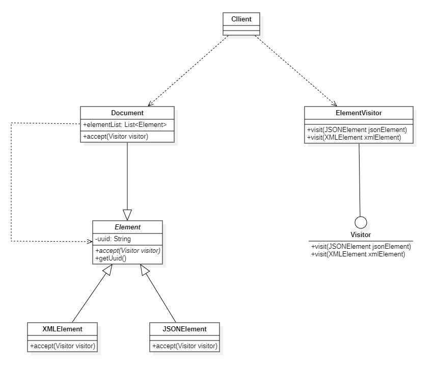
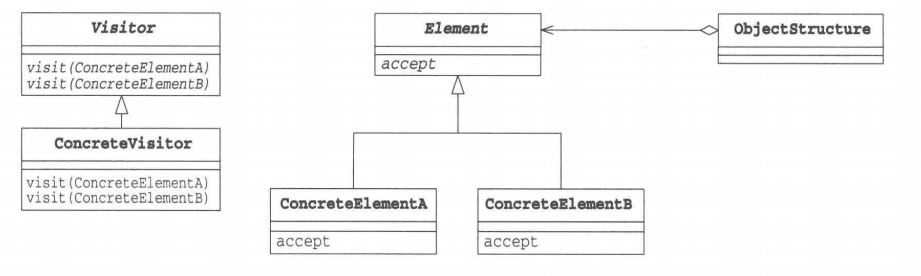

# 访问者模式

## 概述

&emsp;在很多教材和博主看来，访问者（Visitor）模式属于设计模式中最难的模式。在访问者模式中，我们使用了一个访问者类，它改变了元素类的执行算法。通过这种方式，元素的执行算法可以随着访问者改变而改变。根据这种模式，元素对象已接受访问者对象，这样访问者对象就可以处理元素对象上的操作。

## 类型

&emsp;访问者模式属于行为型模式。

## 介绍

- **目的**：将数据结构与数据操作分离。
- **主要解决**：稳定的数据结构和易变的操作耦合问题。
- **应用场景**：当你需要对一个对象结构中的对象进行很多不同的并且不相关的操作，而需要避免让这些操作“污染”这些对象的类，使用访问者模式将这些封装到类中。
- **解决方案**：在被访问的类里面加一个对外提供接待访问者的接口。

## 示例代码

&emsp;这段示例演示的是对不同类型的文档进行操作，其中`XMLElement`和`JSONElement`共同组成`Document`,这些Element有一个父类`Element`。

### Element抽象类

&emsp;Element是数据结构的父类，对于每一个数据元素，它都有一个允许访问者访问的接口。

```java
package visitor;

public abstract class Element {
    private String uuid;
    public Element(String uuid){
        this.uuid = uuid;
    }
    public String getUuid(){
        return uuid;
    }
    public abstract void accept(Visitor visitor);
}
```

### Document类

&emsp;这里用到了组合模式，并担任复杂元素角色，Document由XMLElement和JSONElement共同组成，是访问者模式中的数据结构。

```java
package visitor;

import java.util.ArrayList;
import java.util.List;

public class Document extends Element{

    List<Element> elementList = new ArrayList<>();

    public Document(String uuid) {
        super(uuid);
    }

    @Override
    public void accept(Visitor visitor) {
        elementList.forEach( e -> e.accept(visitor));
    }
}
```

### XMLElement类

&emsp;数据结构中的数据元素。

```java
package visitor;

public class XMLElement extends Element{
    public XMLElement(String uuid) {
        super(uuid);
    }

    @Override
    public void accept(Visitor visitor) {
        visitor.visit(this);
    }
}
```

### JSONElement类

&emsp;数据结构中的数据元素。

```java
package visitor;

public class JSONElement extends Element{
    public JSONElement(String uuid) {
        super(uuid);
    }

    @Override
    public void accept(Visitor visitor) {
        visitor.visit(this);
    }
}
```

### Visitor接口

&emsp;Visitor接口定义了数据结构中每个数据元素的操作

```java
package visitor;

public interface Visitor {
    
    void visit(JSONElement jsonElement);
    void visit(XMLElement xmlElement);
}
```

### ElementVisitor类

&emsp;ElementVisitor是具体的访问者，具体实现了Visitor中定义的操作。

```java
package visitor;

public class ElementVisitor implements Visitor{
    @Override
    public void visit(JSONElement jsonElement) {
        // 这里是我们对JSONElement元素的操作
        System.out.println("This is a Json element with uuid: "+jsonElement.getUuid());
    }

    @Override
    public void visit(XMLElement xmlElement) {
        // 这里是对XMLElement元素的操作
        System.out.println("This is a Xml element with uuid: " + xmlElement.getUuid());
    }
}
```

&emsp;测试代码及运行结果：

```java
package visitor;

import org.junit.Test;

import java.util.UUID;

public class VisitorTest {
    @Test
    public void visitorTest(){
        // 创建一个元素访问者 这个访问者实现了访问对象的操作
        Visitor elementVisitor = new ElementVisitor();
        // Document由XMLElement和JSONElement组成，操作对象是Document，其子元素：XMLElement和JSONElement
        Document document = new Document(UUID.randomUUID().toString());
        document.elementList.add(new XMLElement(UUID.randomUUID().toString()));
        document.elementList.add(new JSONElement(UUID.randomUUID().toString()));
        document.elementList.add(new JSONElement(UUID.randomUUID().toString()));
        // 通过Document提供的访问者接口进行操作
        document.accept(elementVisitor);
    }
}
```

```text
This is a Xml element with uuid: caa5c31d-3b2b-4b60-9b32-2e550be4e379
This is a Json element with uuid: 1b2377e6-10b4-43ca-bdeb-b48e9ab6b8ad
This is a Json element with uuid: e07222a3-eec1-4ff6-9e52-f025fbf5019b
```

&emsp;类图如下：



## 访问者模式中的角色

- **Visitor**:Visitor角色**负责对数据结构中每个具体元素声明一个用于访问的visit方法，visit(Element)是用于处理Element的方法**。在上述示例中，Visitor扮演着这一角色。
- **ConcreteVisitor**：ConcreteVisitor角色**负责实现Visitor角色所定义的接口，它需要实现所有的visit(Element)方法，即处理每一个ConcreteElement角色**。在上述示例中，ElementVisitor扮演这一角色。
- **Element**：Element角色**表示Visitor角色的访问对象。它声明了接收访问者的accept方法，accept方法接收的参数是Visitor角色**。在上述示例中，Element扮演着这一角色。
- **ConcreteElement**：ConcreteElement角色**负责实现Element角色所定义的接口**。在上述示例中，JSONElement和XMLElement均扮演着这一角色。
- **ObjectStructure**:ObjectStructure角色**负责处理Element角色的集合**。ConcreteVisitor角色为每个Element角色都准备了方法。在上述示例中，Document扮演着这一角色。



## 其它

&emsp;访问者可以对功能进行统一，可以做报表、UI、拦截器与过滤器。